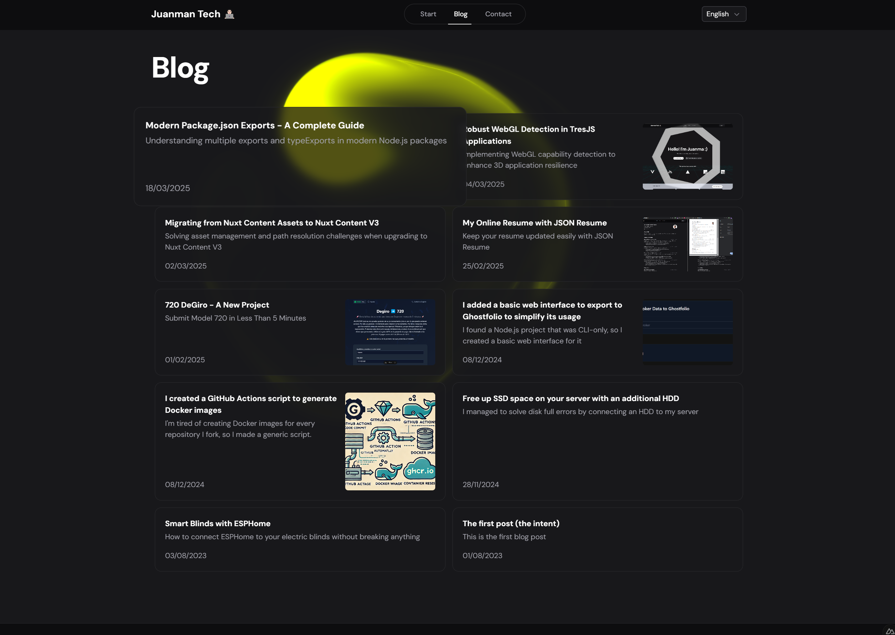

I recently migrated the Splash Cursor component from [ReactBits](https://www.reactbits.dev/animations/splash-cursor) to integrate it into this Vue blog. This process has been interesting both for the technical details of the migration and the current limitations of AI in code migration tasks.

I ended up adding it as an animated background on the blog posts listing page.

## Main Adaptations

The migration required some fundamental changes in how the component interacts with the DOM and manages its lifecycle:

- `useRef` → `ref`: The direct equivalent in Vue for maintaining DOM element references
- `useEffect` → `onMounted`: Although not exactly equivalent, it worked perfectly for WebGL integration

```javascript
// React original
const canvasRef = useRef(null);
useEffect(() => {
  // Setup WebGL
}, []);

// Vue adaptation
const canvasRef = ref(null);
onMounted(() => {
  // Setup WebGL
});
```

## Demo and Source Code

You can see the effect in action in two ways:
- [In the navigation between blog articles](/blog)
- [Full screen view](/tools/cursor)

The complete code is available on [GitHub](https://github.com/JuanmanDev/JuanmanTechBlog/blob/main/components/decoration/cursor.vue).

## Experience with Code AIs

I tried using several AIs to assist with the migration:
- GitHub Copilot with Gemini
- GitHub Copilot with Claude Sonnet
- GitHub Copilot with GPT-4
- DeepSeek R1

Although the migration wasn't particularly complex, none of the AIs could effectively handle the transformation of the complete component. This highlights a current limitation: while AIs are excellent for small and specific tasks, they still struggle with complete component transformations, especially when involving:
- Multiple paradigms (WebGL + framework)
- Large files
- Architectural changes between frameworks

## Conclusions

Manual migration turned out to be the best approach, allowing for:
1. Better understanding of the original code
2. Vue-specific optimizations
3. Simplification of some code parts

For developers considering similar migrations, I recommend:
- Deeply understanding lifecycle equivalents between frameworks
- Performing the migration in phases, starting with the basic structure
- Not relying exclusively on AIs for complete migrations


<br><br><br>


