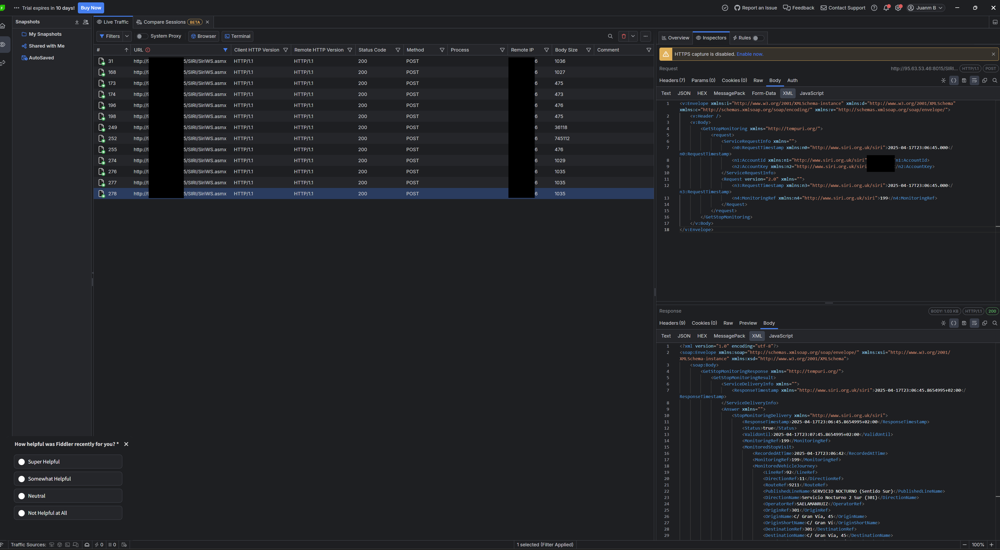
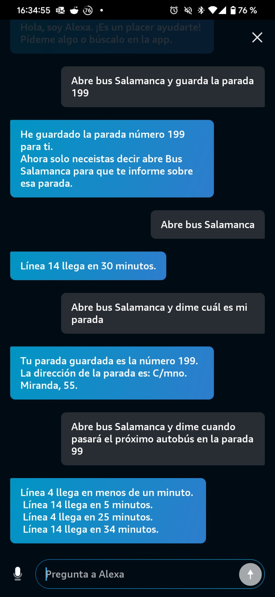
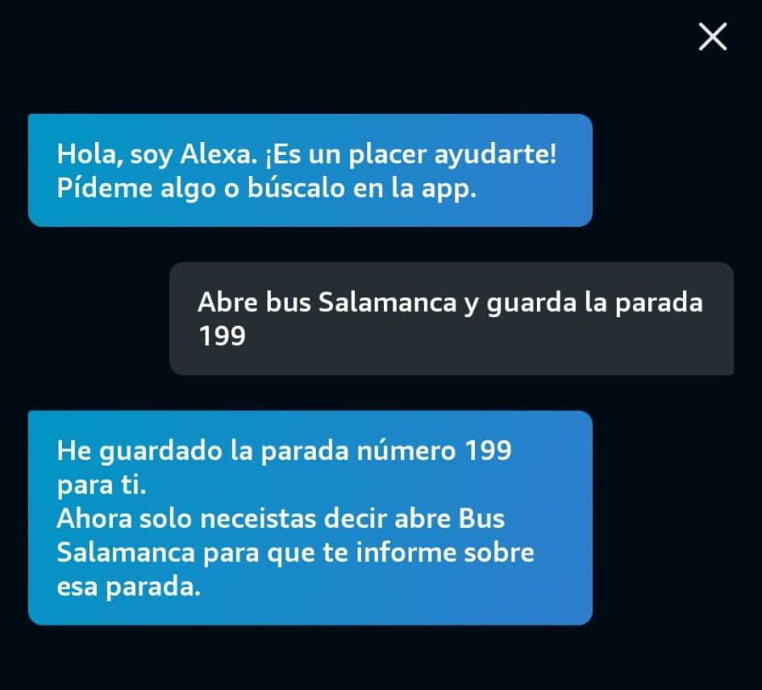
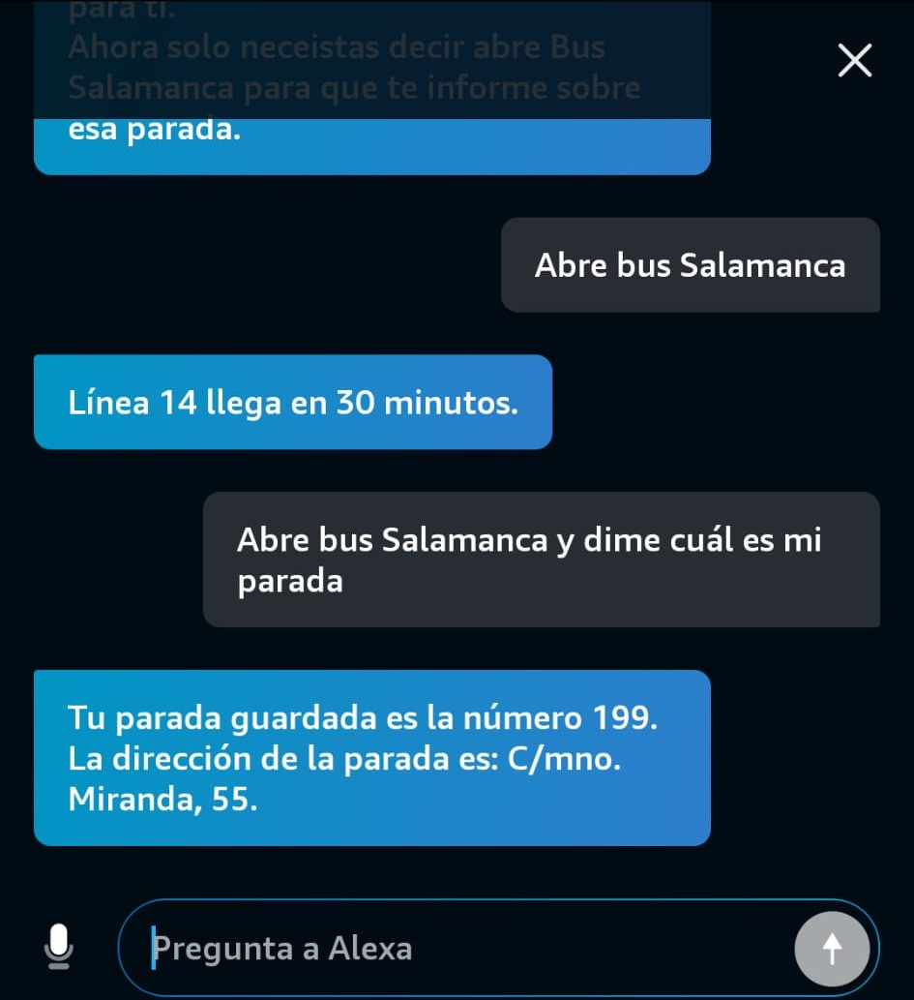

## Introduction

I recently developed an Alexa skill that allows me to check from home how many minutes are left until the next bus arrives at the nearest stop. This solution arose from a personal need, as I have to travel to the center of Salamanca frequently and wanted to optimize my waiting times.

## Process and Architecture

At first, I explored quick systems to create Alexa skills, but most use Node.js 16, a version that is already deprecated. Therefore, I decided to deploy all the infrastructure myself using AWS services.

The architecture is simple and efficient:

- **AWS Lambda**: A Lambda function centralizes all the logic and responds to requests from the Alexa skill.
- **DynamoDB**: I use a DynamoDB database to store relevant information and speed up queries.
- **CloudWatch**: I set up CloudWatch to monitor errors and Lambda usage.
- **Automatic alerts**: I implemented rules that notify me if more than 100,000 weekly calls to Lambda are exceeded, to control the use of AWS's free tier.

## Obtaining the Data

To get the bus information, I discovered some APIs that provide real-time data. I have not contacted the Salamanca urban transport company, but I would like to notify them in the future and hope there will be no issues publishing a skill about their services.

## Tools Used

During development, I used tools such as **HTTP Toolkit** and **Telerik Fiddler** to intercept and analyze API calls, which made integration and debugging easier.

HTTP Toolkit was simpler, but the option to export the request for nodejs was paid, so I used the 10-day trial of Telerik Fiddler.

## Considerations and Limitations

It should be noted that, since it depends on public services, sometimes the information may not be available or may present errors, something I have also noticed in official applications that use the same system. My skill could be affected by these same limitations.
This has happened with bus lines that disappear and reappear, or that do not have real-time information. In these cases, the skill returns a message indicating that no information is available.

## Future and Publication

The project is simple and useful, and I intend to publish it on GitHub soon so that other users can benefit from it or adapt it to their needs.

---

If you have questions or suggestions about this project, feel free to leave a comment. I hope this solution is useful to more people!

