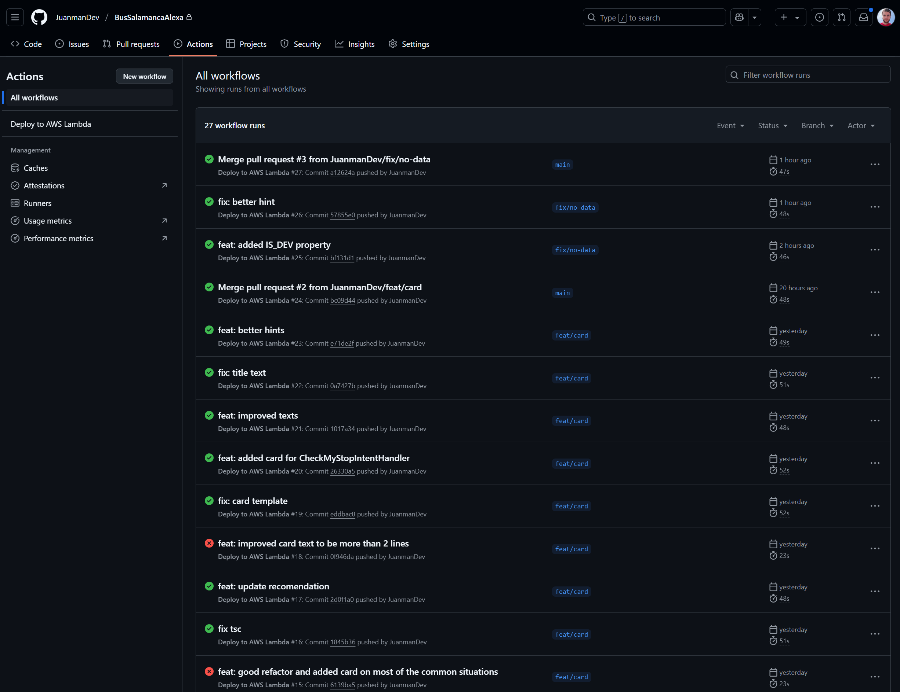
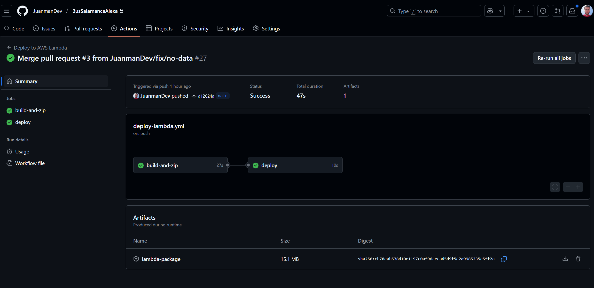
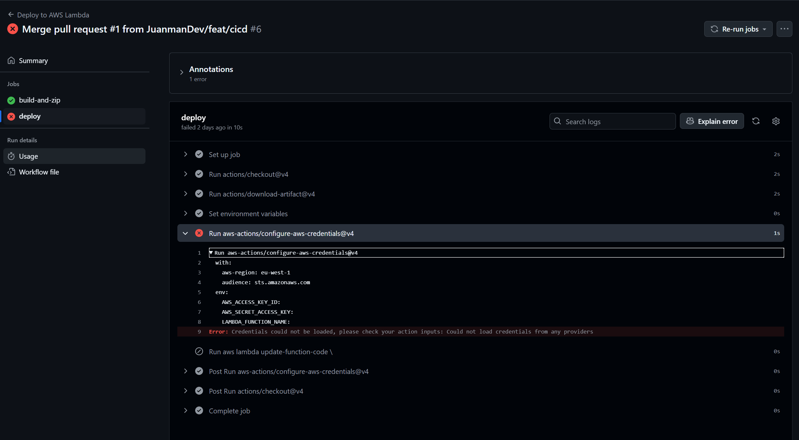
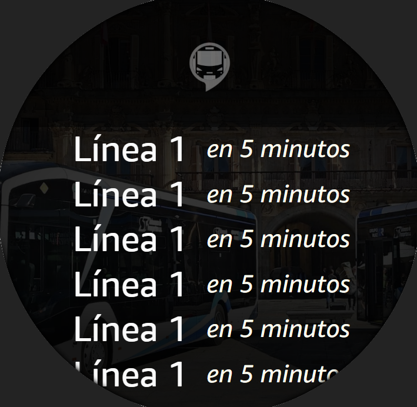
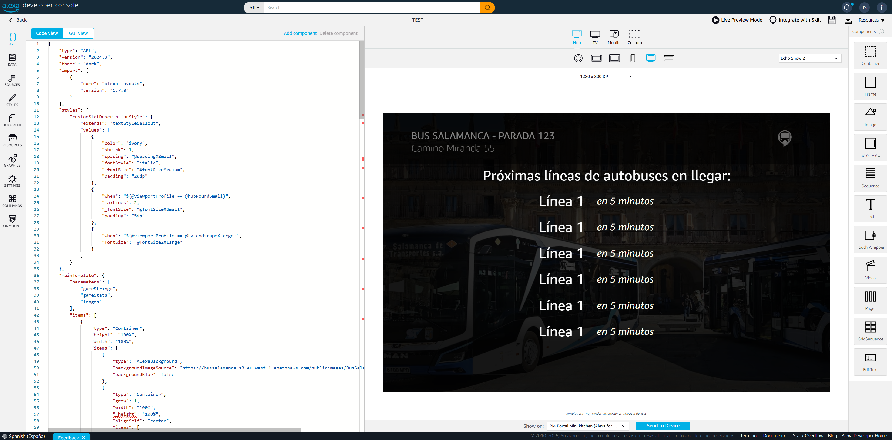

# Improving the Alexa Skill Bus Salamanca

In this post, I share the improvements made to the Alexa skill "Bus Salamanca", as well as some lessons learned and challenges encountered during the process.

---

## Deployment Automation

- I added a **GitHub Workflow** to automatically deploy to AWS Lambda, including credential management via IAM.
- There are now two Lambdas: one for _dev_ and another for _prod_.
- AWS errors have been very descriptive when roles didn't work, which allowed me to fix them quickly.

---

## Environment Management

- I learned that having two environments (_dev_ and _prod_) in the skill is straightforward.
- To publish the development skill, you need to specify the production Lambda.

---

## Improvements to the Graphical Interface (Alexa APL)

- I used **Alexa APL** to enhance the skill's graphical interface.
- The interface adapts to different devices, such as the Echo Spot (small circular screen) and larger devices like the Echo Show.
- Now, useful information is displayed clearly, requiring scrolling only when necessary.

- I used the **Alexa Developer Console** to design the graphical interface and ensure it adapts perfectly to different devices.

- I also improved the initial screen when there is no data, prompting for the stop and showing voice commands to query any stop.

- This is how the upcoming bus lines are displayed:

---

## Technical Considerations

- I discovered that the Lambda runs in a different time zone, so you need to adapt to that.
- After getting the first approval for the skill, the second one took barely an hour to be approved.

---

## User Experience

- I spent more time testing the skill to add better recommendations on devices like the Echo Show, such as suggesting to check the bus once the stop is saved.
- I improved the initial state the first time the skill is shown, making it more intuitive to request information.

---

## Optimization and Robustness

- I tried to optimize the skill, but there are two main points that are hard to improve: contacting the external service and transforming XML to JSON.
- I improved the information shown when the service does not respond or there is no data, preventing the skill from hanging and always providing a response to the user.

---

## Environment Differentiation

- I added a simple way to know if the skill is _dev_ or _prod_, by adding an emoji to the title of the cards shown on screen.

---

## Final Thoughts

I'm considering publishing the code on GitHub, but I'm not sure if it's legal, since the Salamanca API is not public and I don't know if I can share it.

---

If you want to try the Alexa skill, you can find it here: [Bus Salamanca on Amazon Alexa](https://www.amazon.es/Juan-Manuel-B%C3%A9c-Bus-Salamanca/dp/B0F59TDK93/)