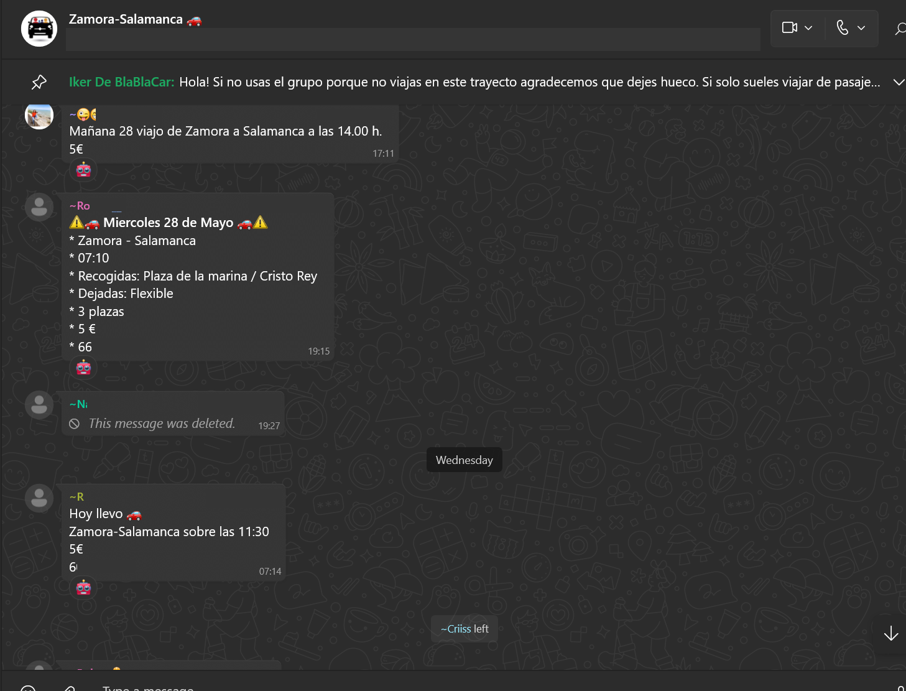
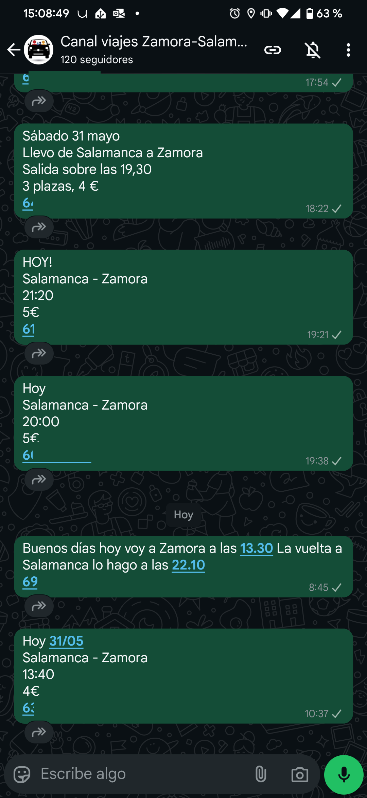
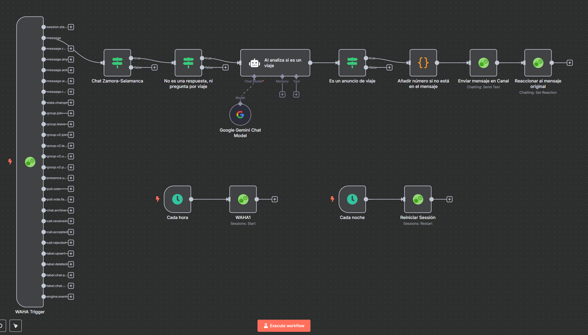

# Automating WhatsApp Message Forwarding to a Channel with n8n, Docker, and WAHA

In this post, I share how I automated the forwarding of messages from a WhatsApp group to a channel using n8n, Docker, and the WAHA library. I set everything up on an old laptop I use as a local server. The goal is to make it easier to manage a ridesharing group between Zamora and Salamanca, which had reached its participant limit.

---

## Challenge Overview

- The WhatsApp group "Zamora-Salamanca" connects drivers and passengers to share rides between Zamora and Salamanca.
- After reaching the 1000-participant limit, a WhatsApp channel was created, but forwarding messages was manual and tedious.
- The challenge: automate filtering and forwarding of ride posts, including the phone number, and mark forwarded messages.

---

## Technical Solution

### General Architecture

- **WAHA**: exposes a WhatsApp API in Docker to automatically receive messages.
- **n8n**: orchestrates the workflow, filters messages, and forwards them to the channel.
- **Google Gemini**: free AI to distinguish ride posts from other messages.

---

### Automated Workflow

1. **Message Reception**  
   WAHA receives messages from the group and sends them to an n8n webhook.

2. **Smart Filtering**  
   n8n queries Google Gemini to decide if the message is a ride post or not.  
   It also automatically discards messages with keywords like "someone" or "looking for".

3. **Enrichment**  
   If the phone number is missing, the system adds it automatically.

4. **Forwarding**  
   The message is published in the WhatsApp channel.

5. **Visual Confirmation**  
   The bot adds a robot reaction 🤖 to the original message to indicate it was forwarded successfully.

---

## Issues and Lessons Learned

- **WAHA Disconnection**  
  The server restarted every Saturday at dawn and WAHA stopped sending messages. I solved it with an automatic Docker container restart routine.

- **Incorrect Message Filtering**  
  At first, questions or replies were forwarded. I added a keyword filter and improved the AI prompt to reduce false positives.

---

## Screenshots





---

## Code and Configuration

### Example docker-compose.yml

```yaml
# filepath: ./docker-compose.yml
version: '3'
services:
  waha:
    image: devlikeapro/whatsapp-http-api
    restart: always
    ports:
      - "3000:3000"
    environment:
      - WHATSAPP_API_KEY=XXXX
      - WAHA_DASHBOARD_USERNAME=XXXX
      - WAHA_DASHBOARD_PASSWORD=XXXX
      - WHATSAPP_DEFAULT_ENGINE=WEBJS
      - WAHA_PRINT_QR=False
      - WAHA_MEDIA_STORAGE=LOCAL
      - WHATSAPP_FILES_LIFETIME=0
      - WHATSAPP_FILES_FOLDER=/app/.media
      - WHATSAPP_RESTART_ALL_SESSIONS=True
      - WAHA_AUTO_START_DELAY_SECONDS=0
      - WHATSAPP_HOOK_URL=https://MY-DOMAIN/webhook/22ad9ac5-be66-XXXX-XXXX-XXXXXXXXX/waha
      - WHATSAPP_HOOK_EVENTS=message,state.change
  n8n:
    image: n8nio/n8n
    restart: always
    ports:
      - "5678:5678"
    environment:
      - N8N_BASIC_AUTH_ACTIVE=true
      # ...otras variables necesarias...
    volumes:
      - ./n8n-data:/home/node/.n8n
```

---

## Technical Considerations

- The server is an old laptop running Linux and Docker.
- The workflow is robust against restarts and network errors.
- Filtering can be improved by adding new keywords or adjusting the AI prompt.

---

## Future Improvements

- Improve filtering using AI and user feedback.
- Add logs and alerts in case the bot fails.
- Automate updating the keyword list.

---

## Final Thoughts

This automation has reduced manual effort and made the group much more useful for everyone. If you have a large group and need to automate repetitive tasks, I encourage you to try n8n and Docker.

---

Would you like to see the full n8n workflow or need help configuring WAHA? Leave your questions in the comments.

---

## Useful Resources

- [WAHA: WhatsApp HTTP API + n8n (tutorial)](https://waha.devlike.pro/blog/waha-n8n/)
- [n8n (official website)](https://n8n.io/)
- [Google Gemini API (pricing and docs)](https://ai.google.dev/gemini-api/docs/pricing?hl=es-419)