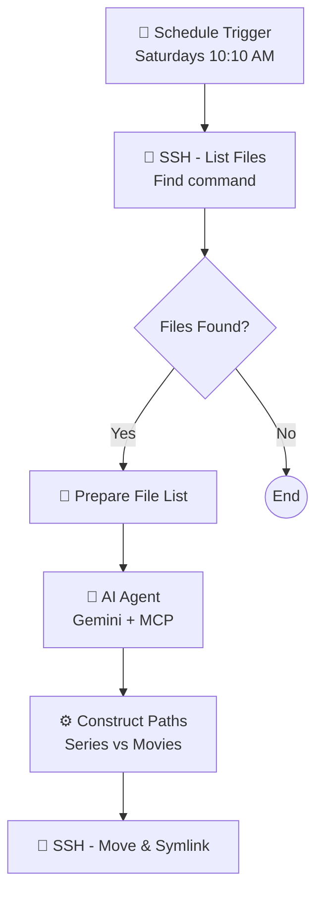

# Automatically Organize Your Series and Films with n8n and AI

Do you have a download folder that looks like a mess? Organizing media for Jellyfin or Plex can be a tedious task. In this post, I'll share an n8n workflow that automates this entire process using AI to distinguish between movies and series, fetching metadata, and moving files to the correct folders (`/Series` or `/Peliculas`), all while keeping symlinks intact for your P2P clients.

---

## The n8n Workflow Architecture

Here is an overview of how the automation works:



---

## Step-by-Step: Analyzing the Automation

### 1. The Trigger
We start with a **Schedule Trigger** that runs periodically (e.g., every Saturday at 10:10 AM). This prevents the system from checking constantly and allows for batch processing of downloads.

### 2. Smart File Listing (SSH)
We access the server via SSH and use a robust `find` command to list only the relevant files:

```bash
find /mnt/hdd_cache/share/public/amule/ /mnt/hdd_cache/share/public/torrent/complete/ -maxdepth 1 -type f -not -type l -not -name "*.nfo" -not -iname "*xubuntu*" -not -iname "*adobe*"
```

**Key Points:**
*   `-type f`: We only look for files, not directories.
*   `-not -type l`: **Ignore symlinks**. This is crucial to avoid processing files that have already been organized.
*   `-not -iname "*xubuntu*"...`: We filter out specific names we know are not media (Linux distros, software), optimizing API usage.

### 3. The Brain: AI Agent with MCP
This is where the magic happens. We use an **AI Agent** node connected to a **Google Gemini Chat** model.

To empower the AI, we use the **mcp-imdb** server, a tool that allows querying movie databases.
> **Note:** I have updated the MCP server to support Docker. You can find my fork here: [JuanmanDev/mcp-imdb](https://github.com/JuanmanDev/mcp-imdb/) and the original source [here](https://github.com/clsung/mcp-imdb).

The prompt asks the AI to analyze each filename and determine:
*   If it is a **Movie** or a **Series**.
*   If it is a Series, extract the **Clean Series Name** and the **Season Number**.

This is far superior to using Regular Expressions (Regex), as the AI "understands" that "House.M.D.S01..." corresponds to the series "House", Season 1.

### 4. Smart Move & Symlink
Once the AI returns the structured data (JSON), a Code node constructs the destination paths:
*   **Series:** `/mnt/hdd_cache/Series/{SeriesName}/Temporada {SeasonNumber}/filename`
*   **Movies:** `/mnt/hdd_cache/Peliculas/filename`

Finally, the **SSH - Move & Symlink** node executes the move. But this isn't a standard move:

```bash
mkdir -p "$DEST_DIR" && mv "$SOURCE" "$DEST" && ln -s "$DEST" "$SOURCE"
```

**Why Symlink?**
If you are seeding the file in a Torrent client or sharing via aMule, moving the file would break the path and stop the seeding.
By moving the file to its organized folder and immediately creating a **symbolic link** at the original location pointing to the new destination:
1.  Jellyfin/Plex sees the organized file in the correct library folder.
2.  Your P2P client still "sees" the file in the download folder (via the link) and continues sharing it.

---

## Legal Disclaimer
This guide is for educational purposes only, intended for organizing personal backups and media. I do not endorse or recommend the use of illegal or pirated content. Please use legal streaming services or purchase your media. If you are organizing public domain content or Creative Commons works, this tool will be very useful.
