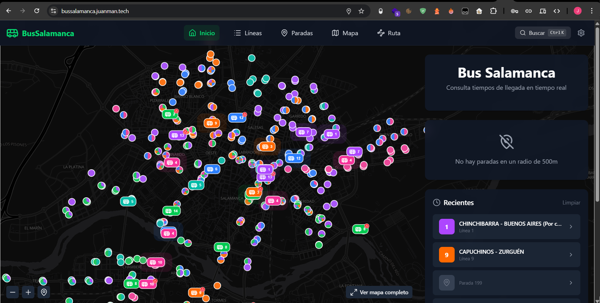
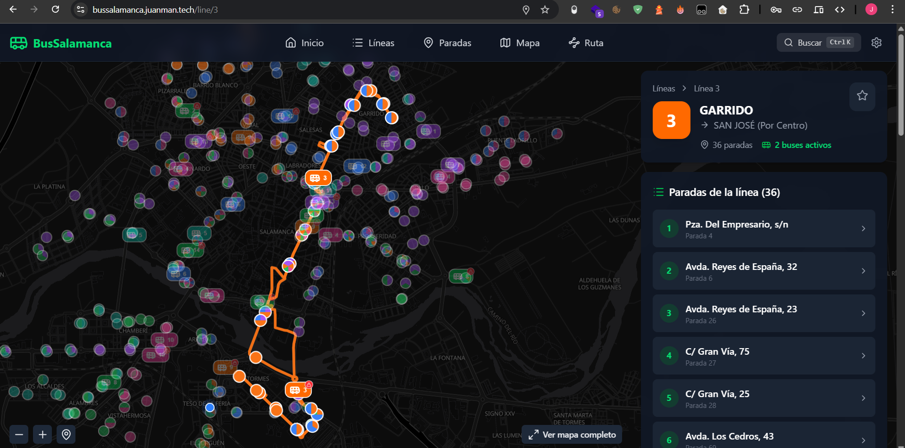
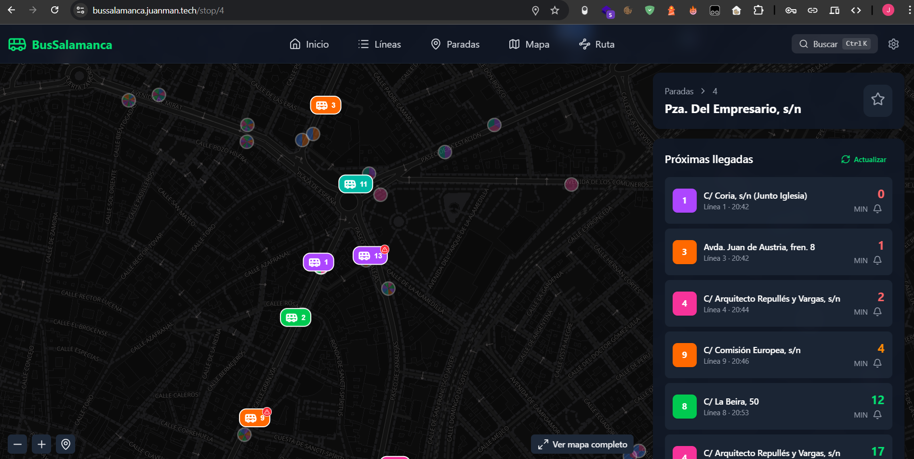

# Bus Salamanca: A New Visual Approach

Some time ago, I created [Bus Salamanca Alexa](https://github.com/JuanmanDev/BusSalamancaAlexa), a skill designed to check arrival times using voice commands. While useful when you are at home getting ready to leave, sometimes voice isn't enough.

What if you want to see the route of the line? Or what if the bus has disappeared from the official API and you don't know if it's coming or if it has already passed? To solve these problems and radically improve usability, I have created the web version: **[Bus Salamanca Web](https://bussalamanca.juanman.tech/)**.

## Key Features

The new web app, accessible on both mobile and desktop, includes features that provide much more than just simple stop time estimations.

### 🗺️ Global Map and Specific Routes
I have implemented a permanent background map powered by **MapLibre GL JS**, featuring a carefully crafted dark mode so that bus positions stand out perfectly. 

Now you can:
- See **all buses** circulating around the city on the main view.
- Select a **specific line** to isolate its route, seeing exactly where each vehicle of that line currently is.

### ⏱️ Arrival Times and Predictive Caching
The heart of the application is still finding out when your bus arrives. By tapping on any stop, you get the next arrivals clearly displayed.

But here is the **real magic**: sometimes, the city's official system experiences outages or temporarily removes a bus from the estimation, causing frustration ("it disappeared from the screen and suddenly showed up at my stop!"). 

I have designed a **caching and predictive estimation system**:
* If a bus was reporting its arrival at a stop, the system saves that estimation.
* If due to a micro-outage the bus stops reporting to the official API on the next query, my system assumes it is still on its way and calculates the remaining time based on the last known data, rather than making it disappear abruptly.
* Thanks to the map view, the user can visually corroborate this by seeing if the bus icon is still approaching.

## Technologies Used

This web app has also served as a proving ground to perfect my stack:
* **Nuxt 4 / Vue 3**: The main frontend engine.
* **MapLibre GL**: For rendering spectacular high-performance interactive vector maps.
* **TailwindCSS**: For all styling, creating "Glassmorphism" interfaces with elegant transparencies.
* **Docker**: For automated deployment of the backend proxy communicating with the city's official SIRI system.

The result is an extremely fast web app that you can easily add to your mobile home screen as if it were a native app, but always up-to-date and without heavy initial downloads.

I invite you to try it out next time you move around Salamanca!  
👉 **[bussalamanca.juanman.tech](https://bussalamanca.juanman.tech/)**
