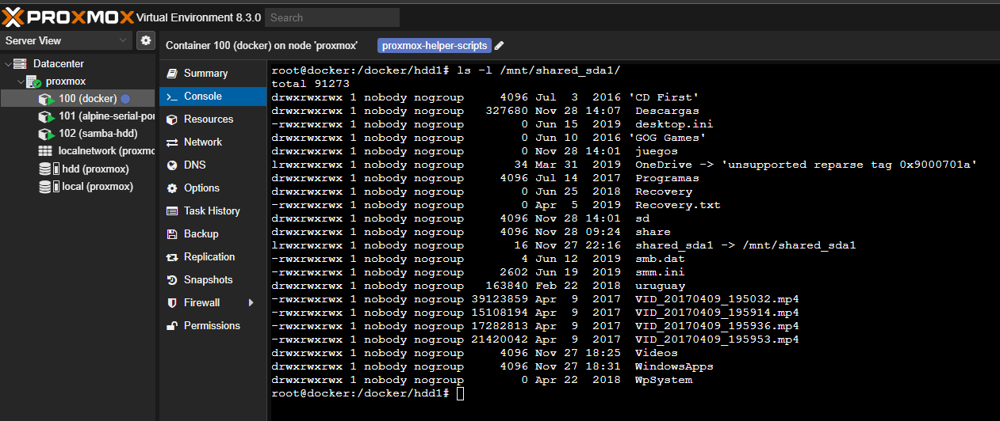

# The Situation

I have an old computer running as a small server at home. It’s on 24/7 and hosts several services like **Home Assistant** or **Frigate** for recording security camera footage. I also use it as a download system for Linux ISOs via torrents, among other things.

I manage everything with **Proxmox** and **Docker**.

# The Problem

The entire system runs on a single **480 GB SATA3 SSD**, which tends to fill up quickly. When that happens, almost nothing works: I can only observe the chaos from the Proxmox web interface. Services start failing, and I have to manually delete files to free up space.

## Quick Fixes

Deleting logs, unused Docker images, and other temporary files has helped in the short term. However, it’s just a temporary fix, and the problem inevitably returns.

# A Long-Term Solution

My server also has a **750 GB HDD** connected, which I wasn’t using. Initially, I avoided it because it seemed slow and possibly damaged, but after inspecting it, I confirmed it’s in good condition and can be used.

### Current State in Proxmox

Here’s how the HDD appears in **Proxmox**:

  

The disk is mounted in Proxmox and is accessible:  

  

However, to use it in an **LXC container**, I needed to share a mount point.

> ⚠️ **Important:** Choose an appropriate name for the shared path, as it must remain consistent across all virtual environments using it (LXC/Docker).

## Mounting a Disk in an LXC Container

1. **Stop the container:**
   ```shell
   pct stop 100
   ```
2. **Edit its configuration file:**  
   Replace `100` with your container’s ID.
   ```shell
   nano /etc/pve/lxc/100.conf
   ```
3. **Add a mount point:**  
   Make sure the path is the same on both the host and the container. In my case, `/mnt/shared_sda1`:
   ```
   mp0: /mnt/shared_sda1,mp=/mnt/shared_sda1
   ```
4. **Restart the container:**
   ```shell
   pct start 100
   ```
5. **Verify access from the container:**  
   Check that you can access the files from inside the container:

     
     

Done! You now have more space available in your LXC container. 🥳

## Using the Space in Docker

To make use of this additional space in Docker, you can move frequently used folders to the HDD and create symbolic links. Here’s a simple script to help you do this:

### Script to Move Folders and Create Symbolic Links

```bash
#!/bin/bash

# Paths
SOURCE="/docker/share"
DESTINATION="/docker/hdd1/share"

# Create the destination folder if it doesn't exist
mkdir -p "$DESTINATION"

# Copy files and folders
cp -ru "$SOURCE/." "$DESTINATION/"

# Check if the copy was successful
if [ $? -eq 0 ]; then
    echo "Files copied successfully. Removing the original folder..."
    rm -rf "$SOURCE"

    # Create a symbolic link
    ln -s "$DESTINATION" "$SOURCE"
    echo "Symbolic link created successfully."
else
    echo "Error copying files. The original folder will not be removed."
    exit 1
fi
```

### Adding the Volume to Docker Compose

To ensure the symbolic link works correctly in Docker, share the HDD directory in your `docker-compose.yml` file. For example:

```yaml
volumes:
  - /mnt/shared_sda1:/mnt/shared_sda1
```

Here’s a full example using a Samba container:

```yaml
name: samba

services:
  samba:
    image: ghcr.io/crazy-max/samba
    container_name: samba
    network_mode: host
    volumes:
      - "./samba.yml:/data/config.yml"
      - "/share:/samba/share"
      - "/docker:/samba/docker"
      - "/docker/hdd1:/samba/hdd1"
      - /mnt/shared_sda1:/mnt/shared_sda1
    environment:
      - "TZ=Europe/Paris"
      - "SAMBA_LOG_LEVEL=0"
    restart: unless-stopped
```

Restart the affected containers to apply the changes.

### Final Result

Now, with the additional HDD, I have much more space available on my server:  

  

Thank you for reading! 😊