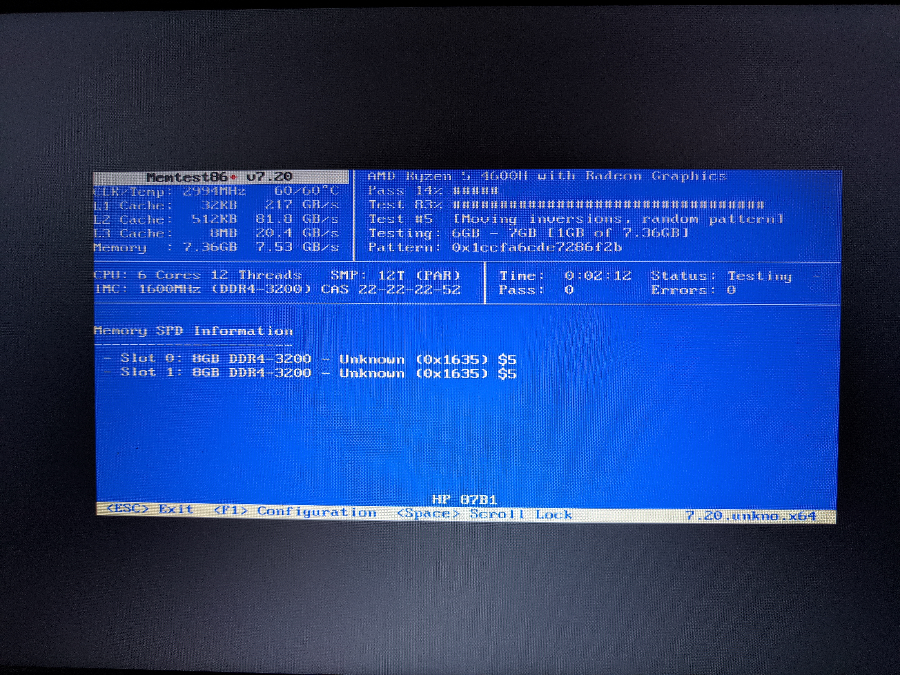
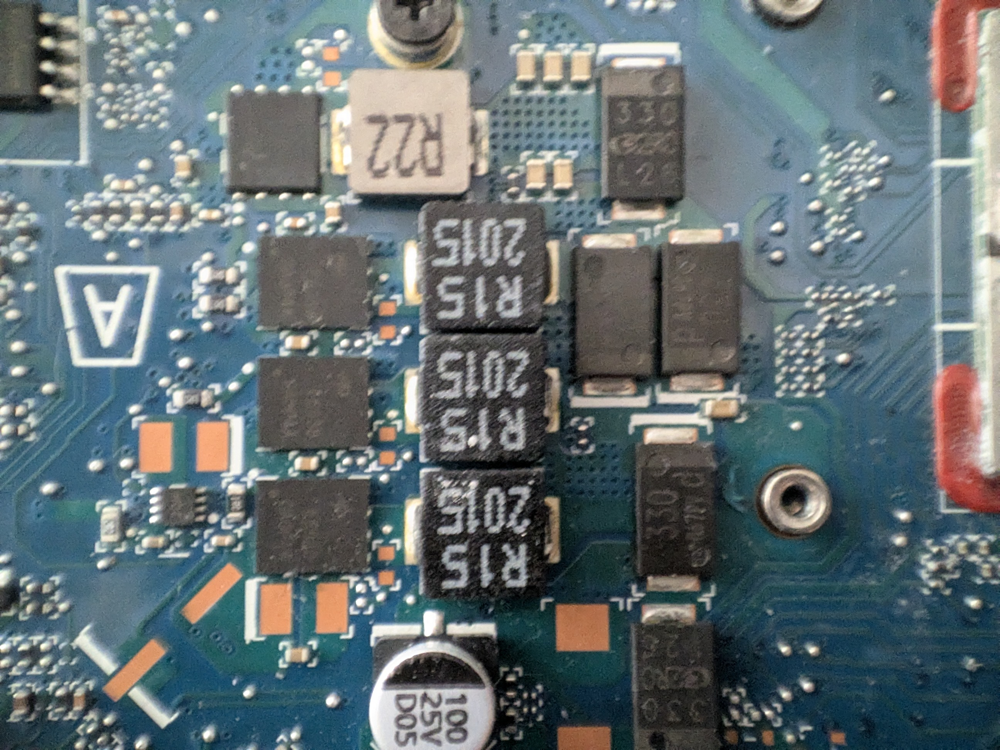

# The "dead" computer that AI managed to resurrect

Recently, I faced one of those hardware/software problems that makes you consider throwing a computer in the trash. I had a machine (an HP Pavilion Gaming 15 with an AMD Ryzen 5 4600H) that, literally, **shut down abruptly 3 seconds after trying to boot any modern operating system** (be it native Windows, Linux, or Proxmox).

The only way to keep it running was by passing the `acpi=off` parameter to the Linux kernel in the GRUB menu. But of course, disabling ACPI on a modern machine means losing power management, multiprocessing, temperature control, and leaving a 12-thread processor running on a single core at a ridiculous speed. A completely useless server.

Since solving this manually required astonishing reverse engineering skills at the BIOS and kernel level, I decided to try a different approach: **let Artificial Intelligence do the advanced diagnostic work.**

## The dynamics of the rescue team

The process turned into an extreme teamwork effort between myself and several AI agents (Gemini and Anthropic's Claude):

* **The AI investigated:** Through an SSH tunnel on the rudimentary system (with `acpi=off`), the AI ran scripts to interact directly with the chipset's memory registers and ports, looking for what was causing the crash.
* **The Starting Prompt:** To put the AIs in context and not waste time with trivial diagnostics, the prompts had to be extremely technical and include credentials to automate the process. For example:
  > *"I have a Proxmox server (HP Pavilion with Ryzen 5). It shuts down instantly 3 seconds after loading the kernel unless I use `acpi=off`. We have ruled out temperature and CPU damage. I want to isolate which ACPI instruction or port causes the hardware shutdown. We are connected via SSH in `acpi=off` mode. The IP is 192.168.2.102, user 'root' and password 'P4ssw0rd!'. Generate and install an SSH key so you can reconnect directly and continuously after each physical reboot without asking for the password. What `inb`/`outb` commands or MMIO memory reads can we run to probe the physical ports (PM_TIMER, SMI, APIC) and trigger the crash manually?"*
* **The server collapsed:** Every time the AI tried to manually activate the power subsystems (the ACPI) via hardware-level probes, the server shut down instantly as if the battery had been removed, and the AI's SSH session dropped.
* **The human corrected and rebooted:** The AIs didn't always hit the right key on the first try. They often suggested GRUB configurations with incorrect syntax or applied patches improperly. I had to review, fix the GRUB option, cross my fingers, physically reboot the machine, and observe the behavior to provide feedback to the AI.


## Failed tests and the surrender of Gemini

The research phase was brutal. We started by ruling out basic hardware. Windows died. Proxmox died. However, pre-OS tools like Memtest86+ v7 survived perfectly, running 12 threads for minutes, indicating the processor was not damaged.

We began the battery of software tests:
1. We tried using `acpi=ht`. The system died. We would later discover (after investigating the kernel source code) that this parameter was removed in version 2.6.35 and is now silently ignored, meaning we were booting with full ACPI without knowing it.
2. We extracted the machine's original ACPI tables, decompiled them, modified the DSDT and FACP (setting `SMI_CMD=0`), and re-injected them via a modified `initrd`. The system died.
3. We tried blacklisting modules with `initcall_blacklist=acpi_init`. The system died.

At this point of desperation after dozens of physical reboots, **Gemini gave up**. The model started looping and couldn't get past the same sterile recommendations.

It was then that **Claude (Anthropic) took the reins** and suggested a much more aggressive approach: probing the ports live.

## The discovery of the true culprit: The Firmware

We booted in `acpi=off` mode (where the machine was stable) and, over SSH, started reading and writing directly to the hardware using `inb` / `outb` commands.

* We probed the ECAM zone (reading MMIO registers of 30 PCIe devices). The server survived.
* We probed the HPET, APIC, and PM_TIMER. The server survived.
* We wrote directly to the `SCI_EN=1` control register (port `0x804`). The server survived.

Finally, Claude proposed running the exact command that the Linux kernel uses to ask the motherboard to hand over power control to the operating system. We executed:
`outb 0xA0 0xB2` (Send the value 0xA0 to the SMI port 0xB2).

**BOOM! Instant shutdown.**

We had found the root cause, confirmed experimentally. The problem was a rather unusual design flaw at the motherboard level: **the BIOS SMM (System Management Mode) handler that processes the ACPI_ENABLE command was broken**. Upon receiving the standard command sent by any modern operating system, the BIOS panicked and completely cut the power.

## The magic patch: Pre-activating ACPI from GRUB

Knowing this, we needed Linux not to send that deadly command. The ACPI specification states that if the `SCI_EN` bit is already active when the kernel boots, it assumes the hardware is already in ACPI mode and **skips** sending the SMI command.

This is where my manual intervention was critical. After polishing the AI's suggestions, we designed a definitive solution. We created a new script in `/etc/grub.d/09_scifix` to automatically generate a patched boot entry that would survive Proxmox kernel updates:

```bash
#!/bin/sh
exec tail -n +3 $0
# This file provides an ACPI SCI_EN patch for HP Pavilion
# Remember to grant permissions: chmod +x /etc/grub.d/09_scifix

echo "Generating Proxmox menu with ACPI SCI patch..." >&2

cat << EOF
menuentry 'Proxmox VE (ACPI SCI fix - 12 cores)' --class proxmox --class gnu-linux --class gnu --class os {
    insmod part_gpt
    insmod ext2
    insmod lvm
    insmod iorw
    
    # THE MAGIC PATCH: Pre-activate ACPI by sending 1 to port 0x804
    outw 0x804 0x1
    
    # Load the normal kernel (make sure to adapt the paths to your LVM/UUID)
    linux /boot/vmlinuz-6.8.4-2-pve root=/dev/mapper/pve-root ro quiet
    initrd /boot/initrd.img-6.8.4-2-pve
}
EOF
```

To apply it permanently:
1. We gave it execution permissions: `chmod +x /etc/grub.d/09_scifix`.
2. We configured the default boot in `/etc/default/grub` by adding `GRUB_DEFAULT="Proxmox VE (ACPI SCI fix - 12 cores)"`.
3. We ran `update-grub`.



This way, GRUB pre-activates the bit on port `0x804`. When Proxmox boots, it detects that the machine is already in ACPI mode, skips the fatal instruction, and **boots perfectly with its 12 threads, full power management, and total stability**.

## The extra physical surprise

During the investigation, we did discover a real, parallel hardware problem.



Upon opening the laptop and swapping the RAM, we confirmed that **channel B (RAM slot 2) was completely dead on the motherboard**. The modules were healthy, but the board was incapable of using them in that socket. A physical failure that, curiously, was unrelated to the random shutdowns, but limited the server to only using 8 GB of RAM.

Thanks to the brutal persistence and synergy between a stubborn human rebooting servers and a brilliant Claude dictating tests to pure hardware, we were able to isolate a firmware failure that would have led anyone else to throw the machine in the trash, managing to rescue a laptop and turn it into a fully functional Proxmox server.
