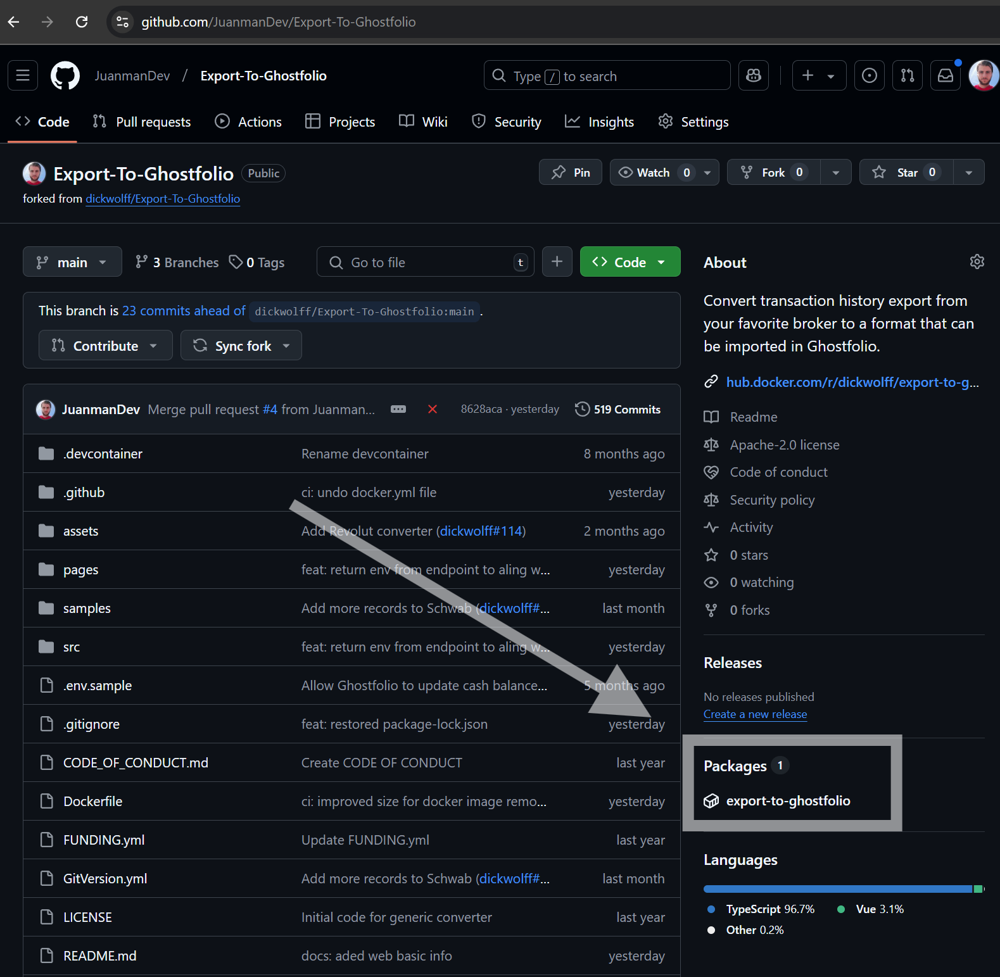
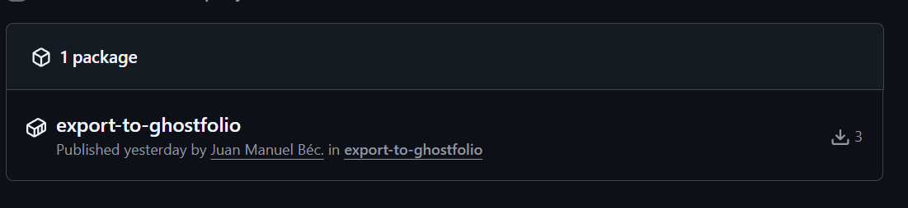
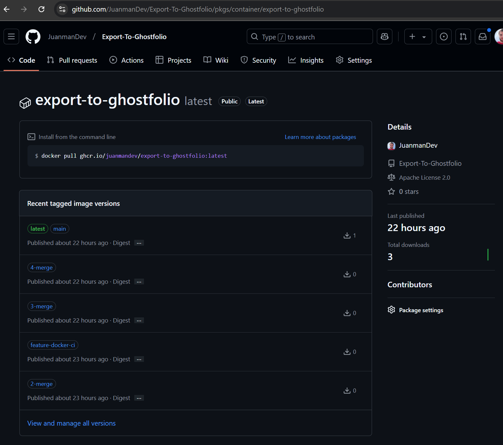
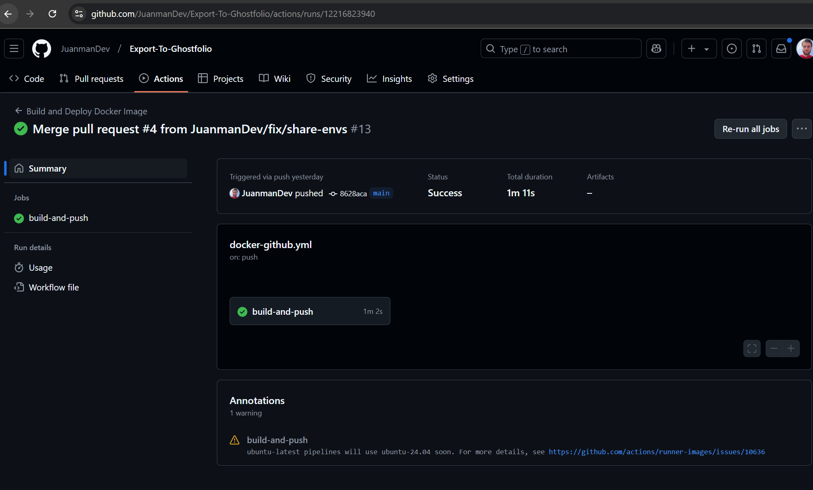

# How to Generate a Docker Image from GitHub

There are numerous tutorials online about how to deploy a Docker image on GitHub.

GitHub provides the ability to host Docker images in its own registry, though it’s important to keep in mind the total number of downloads.

Recently, I have forked several projects where I wanted to quickly generate a Docker image, such as: [bolt](https://github.com/JuanmanDev/bolt.new-any-llm-1/) and [export-to-goshtfolio](https://github.com/JuanmanDev/Export-To-Ghostfolio). To streamline this task, I created a generic script that runs in GitHub Actions (GitHub's CI/CD system) to generate the image easily:


```yml
name: Build and Deploy Docker Image to Github Registry

on:
  push:
    branches:
      - main
      - feature/docker*
      - feature/add-docker*
  pull_request:
    branches:
      - main
      - feature/docker*
      - feature/add-docker*

jobs:
  build-and-push:
    runs-on: ubuntu-latest

    steps:
      # Paso 1: Clonar el repositorio
      - name: Check out code
        uses: actions/checkout@v3

      # Paso 2: Configurar Node.js versión 22
      - name: Setup Node.js
        uses: actions/setup-node@v3
        with:
          node-version: 22
          cache: 'npm'

      # Paso 3: Instalar dependencias
      - name: Install dependencies
        run: npm install

      # Paso 4: Construir la imagen de Docker utilizando un script de npm
      - name: Build Docker image
        run: |
          REPO_NAME=$(echo "${{ github.repository }}" | awk -F '/' '{print $2}' | tr '[:upper:]' '[:lower:]')
          docker build -t $REPO_NAME:latest .

      # Paso 5: Iniciar sesión en el registro de contenedores de GitHub
      - name: Log in to GitHub Container Registry
        uses: docker/login-action@v2
        with:
          registry: ghcr.io
          username: ${{ github.actor }}
          password: ${{ secrets.GITHUB_TOKEN }}

      # Paso 6: Etiquetar y subir la imagen de Docker con una etiqueta específica de la rama
      - name: Push Docker image with branch-specific tags
        run: |
          REPO_NAME=$(echo "${{ github.repository }}" | awk -F '/' '{print $2}' | tr '[:upper:]' '[:lower:]' | sed 's/[^a-z0-9._-]/-/g')
          REPO_OWNER=$(echo "${{ github.repository_owner }}" | tr '[:upper:]' '[:lower:]')
          IMAGE_NAME=ghcr.io/$REPO_OWNER/$REPO_NAME

          # Sanear el nombre de la rama para que sea compatible con Docker
          SANITIZED_BRANCH_NAME=$(echo "${{ github.ref_name }}" | sed 's/[^a-zA-Z0-9._-]/-/g')

          docker tag $REPO_NAME:latest $IMAGE_NAME:$SANITIZED_BRANCH_NAME
          docker push $IMAGE_NAME:$SANITIZED_BRANCH_NAME

      # Paso 7: Subir la etiqueta 'latest' solo en la rama main
      - name: Push 'latest' tag for main branch
        if: github.ref == 'refs/heads/main'
        run: |
          REPO_NAME=$(echo "${{ github.repository }}" | awk -F '/' '{print $2}' | tr '[:upper:]' '[:lower:]' | sed 's/[^a-z0-9._-]/-/g')
          REPO_OWNER=$(echo "${{ github.repository_owner }}" | tr '[:upper:]' '[:lower:]')
          IMAGE_NAME=ghcr.io/$REPO_OWNER/$REPO_NAME

          docker tag $REPO_NAME:latest $IMAGE_NAME:latest
          docker push $IMAGE_NAME:latest
```


By running this script, a Docker image will be automatically generated in the project:








https://github.com/JuanmanDev/Export-To-Ghostfolio/actions/runs/12216823940


https://github.com/JuanmanDev/Export-To-Ghostfolio/actions/runs/12216823940/job/34080344574


## There’s Always Room for Improvement
An interesting enhancement would be to generate a GitHub release with version notes. This could be achieved using [semantic-release](https://github.com/semantic-release/semantic-release). For now, this script is sufficient for projects that require a quick and simple Docker image.

I hope you found it helpful!
