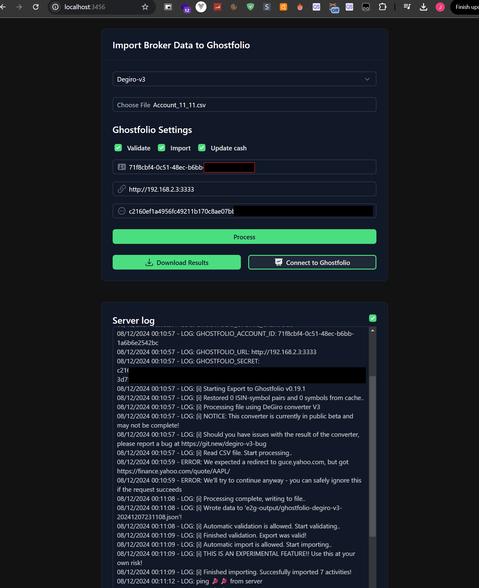

# A Simpler Web Interface Compared to a CLI Command

I discovered [Ghostfolio](https://ghostfol.io/en/start), a system to manage your finances on your own server.

I also found another project on GitHub to import my shares from Degiro into Ghostfolio:
[Export-To-Ghostfolio](https://github.com/dickwolff/Export-To-Ghostfolio/).

## Everything in One Weekend

In just one weekend, I modified the original project.

The idea was to migrate everything to a web interface, removing the need for a backend. However, the CSV processing required Node.js, so I kept it for now. I set up a basic Express.js server and created a Nuxt front-end to serve it.

There’s still a lot to improve: the code needs refinement, tests need to be added, and many other enhancements are pending. But considering it’s just two days of work, I’m fairly happy with the result so far.

## Find the Code on GitHub

- [My version of the project](https://github.com/JuanmanDev/Export-To-Ghostfolio/tree/main)
- [Pull Request to the original repo](https://github.com/dickwolff/Export-To-Ghostfolio/pull/132)

# Videos

### Error if you haven’t filled in all fields:
<video controls src="../../es/blog/4/ExportToGhostfolio_NoSetShotfpholiaACcount.mp4" title="Title"></video>

### Successful session
<video controls src="../../es/blog/4/ExportToGhostfolio_AllFine.mp4" title="Title"></video>

# Additional Notes

Some issues I encountered:

- When exporting all my data from Degiro, some records break and produce empty lines in the CSV. I’ve contacted them about this.
- Certain transactions aren’t accounted for in the script, so I’ll likely modify it in the future for those particular cases.
- The video shows my local access tokens, but I will delete everything and create a new instance with the correct data once I better understand Ghostfolio.

Thanks!
