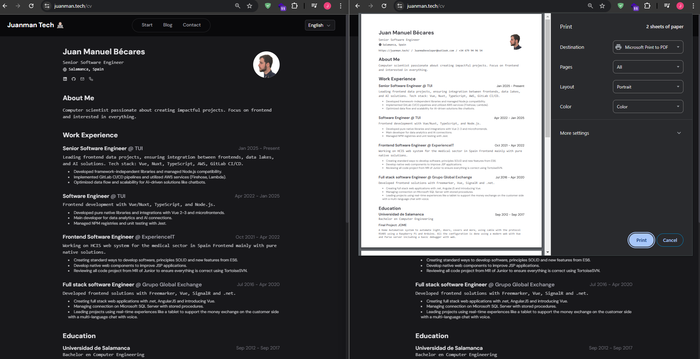

# My Online Resume with JSON Resume

Recently, I created a website to host my online resume using **[JSON Resume](https://jsonresume.org/)** as a template. This tool allowed me to keep my resume updated easily and efficiently.

## Why JSON Resume?

JSON Resume is a tool that allows you to define your resume in JSON format, making it simple to update and maintain. There are also many available templates that can be customized to suit your needs.

## Customization and Dark Mode

To make my resume more attractive and accessible, I updated the style—especially for **dark mode**. I also decided to hide the header and footer so that the main content stands out.

### Steps to Create Your Resume with JSON Resume

1. **Define your resume in JSON format**: Use the JSON Resume schema to structure your information.
2. **Choose a template**: Select one of the available templates on JSON Resume or create your own.
3. **Customize the style**: Adjust the CSS styles to match your preferences, including dark mode.
4. **Hide unnecessary elements**: If desired, hide the header and footer to bring focus to the main content.

## Benefits of an Online Resume

- **Quick updates**: You can update your resume at any time, with changes reflecting immediately online.
- **Accessibility**: Your resume will be available online, making it easier to share with potential employers or collaborators.
- **Customization**: You can adjust the design and style to match your personality and preferences.

## Want to See My Resume?

You can visit my online resume at the following address: [My Resume - /cv](/cv).

## Acknowledgements

I would like to thank Midu for sharing this very useful resource. You can watch his explanatory video here:

<iframe width="560" height="500" src="https://www.youtube.com/embed/Zwh92LTB-Bk?si=m4if9jfbMNBrKalq" title="YouTube video player" frameborder="0" allow="accelerometer; autoplay; clipboard-write; encrypted-media; gyroscope; picture-in-picture; web-share" referrerpolicy="strict-origin-when-cross-origin" allowfullscreen></iframe>

---

:) 