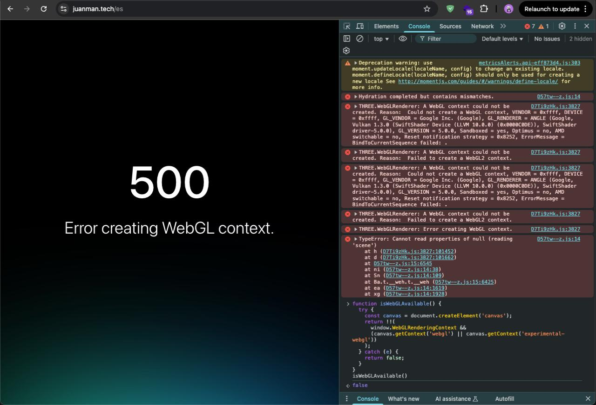
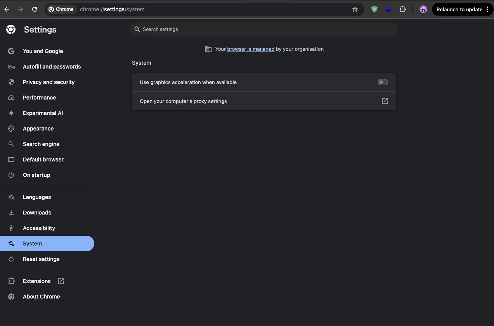

While implementing 3D graphics in a web application using TresJS, I encountered a significant architectural challenge worth sharing: handling environments without WebGL support.

## Background & Learning Resources

My implementation journey began with [midudev's course on 3D experiences with Vue](https://midu.dev/curso/experiencias-3d-con-vue), taught by Alvaro Sabu. For those interested in diving deeper into this topic, I also recommend this excellent FireShip resource:

<iframe width="560" height="500" src="https://www.youtube.com/embed/Q7AOvWpIVHU?si=0O6dT7Zk9Vy9k-BZ" title="YouTube video player" frameborder="0" allow="accelerometer; autoplay; clipboard-write; encrypted-media; gyroscope; picture-in-picture; web-share" referrerpolicy="strict-origin-when-cross-origin" allowfullscreen></iframe>

## The Technical Challenge

During Chrome/MacOS testing, I encountered this error:



Initially suspected to be a MacOS-specific issue, the root cause was actually disabled hardware acceleration in the browser:



## Engineering a Robust Solution

While enabling hardware acceleration resolved the immediate issue, this scenario prompted me to implement a more resilient strategy. Web applications must gracefully handle various client-side configurations.

### WebGL Support Detection

This utility function provides reliable WebGL availability detection:

```javascript
function isWebGLAvailable() {
  try {
    const c = document.createElement('canvas');
    return !!(
      window.WebGLRenderingContext &&
      (c.getContext('webgl') || c.getContext('experimental-webgl'))
    );
  } catch (e) {
    return false;
  }
}
```

### Implementation with Visual Feedback

To enhance UX, I implemented smooth state transitions using CSS and conditional rendering in Vue:

```vue
<template>
  <TresCanvas 
    v-if="isWebGLAvailable" 
    ref="canvas" 
    :class="{ 
      'opacity-simple-animation-100': !isLoading, 
      'opacity-simple-animation-0': isLoading 
    }"
  >
    // ...3D canvas configuration...
  </TresCanvas>
  <div v-else class="fallback-content">
    <!-- Fallback content for non-WebGL environments -->
  </div>
</template>

<style lang="css">
.opacity-simple-animation-0 {
  opacity: 0;
  transition: opacity 0.5s ease;
  transform-style: preserve-3d;
}

.opacity-simple-animation-100 {
  opacity: 1;
  transition: opacity 0.5s ease;
  transform-style: preserve-3d;
}
</style>
```


## Technical Benefits

This implementation provides several architectural advantages:

1. **Enhanced Visual Feedback**: Smooth transitions improve perceived performance
2. **Application Resilience**: Prevents cascading failures in non-WebGL environments
3. **Progressive Enhancement**: Delivers appropriate experiences based on client capabilities

You can explore a live implementation and interact with the animation at [/tools/tresjs](/tools/tresjs).

## Further Considerations

For production environments, consider implementing:
- Performance metrics tracking
- Automated WebGL support testing
- Fallback content optimization
