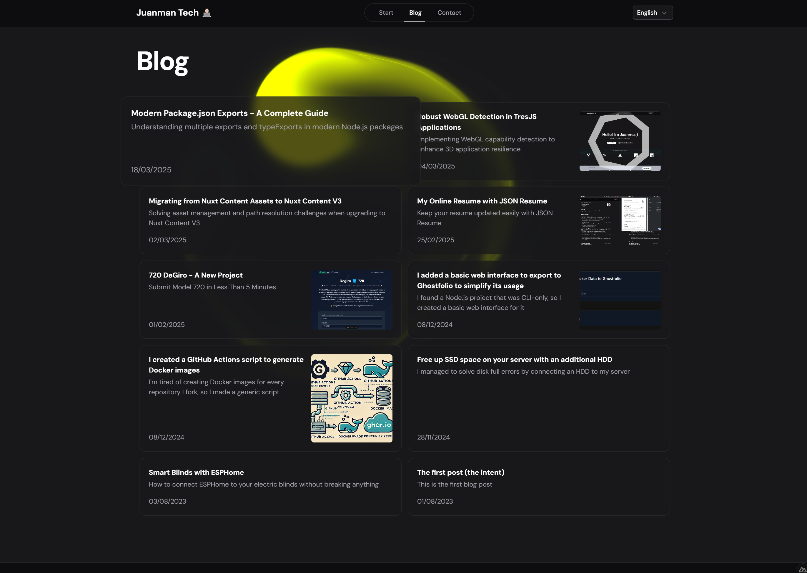

Recientemente migré el componente Splash Cursor de [ReactBits](https://www.reactbits.dev/animations/splash-cursor) para integrarlo en este blog hecho con Vue. Este proceso ha sido interesante tanto por los detalles técnicos de la migración como por las limitaciones actuales de las IA en tareas de migración de código.

Terminé añadiéndolo como un fondo animado en la página de listado de artículos del blog.

## Principales Adaptaciones

La migración requirió algunos cambios fundamentales en cómo el componente interactúa con el DOM y gestiona su ciclo de vida:

- `useRef` → `ref`: El equivalente directo en Vue para mantener referencias a elementos del DOM
- `useEffect` → `onMounted`: Aunque no es exactamente equivalente, funcionó perfectamente para la integración con WebGL

```javascript
// Original en React
const canvasRef = useRef(null);
useEffect(() => {
  // Configuración de WebGL
}, []);

// Adaptación a Vue
const canvasRef = ref(null);
onMounted(() => {
  // Configuración de WebGL
});
```

## Demo y Código Fuente

Puedes ver el efecto en acción de dos maneras:
- [En la navegación entre artículos del blog](/es/blog)
- [Vista a pantalla completa](/tools/cursor)

El código completo está disponible en [GitHub](https://github.com/JuanmanDev/JuanmanTechBlog/blob/main/components/decoration/cursor.vue).

## Experiencia con IAs de Código

Probé varias IAs para ayudar con la migración:
- GitHub Copilot con Gemini
- GitHub Copilot con Claude Sonnet
- GitHub Copilot con GPT-4
- DeepSeek R1

Aunque la migración no era particularmente compleja, ninguna de las IAs pudo manejar eficazmente la transformación completa del componente. Esto resalta una limitación actual: aunque las IAs son excelentes para tareas pequeñas y específicas, todavía tienen dificultades con transformaciones completas de componentes, especialmente cuando involucran:
- Múltiples paradigmas (WebGL + framework)
- Archivos grandes
- Cambios arquitectónicos entre frameworks

## Conclusiones

La migración manual resultó ser la mejor opción, permitiendo:
1. Mejor comprensión del código original
2. Optimización específica para Vue
3. Simplificación de algunas partes del código

Para los desarrolladores que consideren migraciones similares, recomiendo:
- Comprender profundamente los equivalentes de ciclo de vida entre frameworks
- Realizar la migración en fases, comenzando con la estructura básica
- No depender exclusivamente de las IAs para migraciones completas


