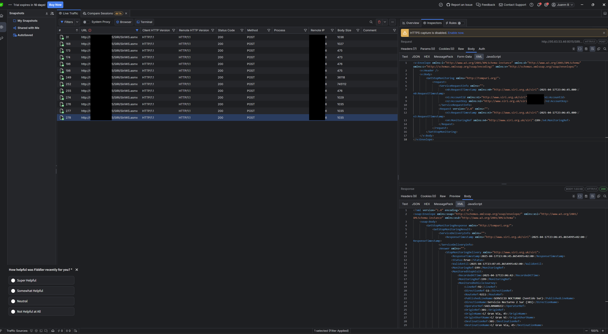
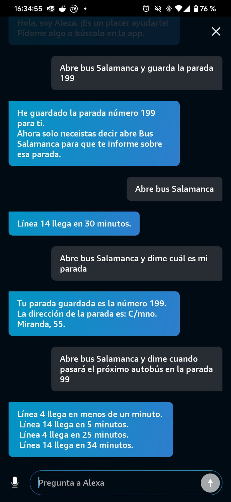
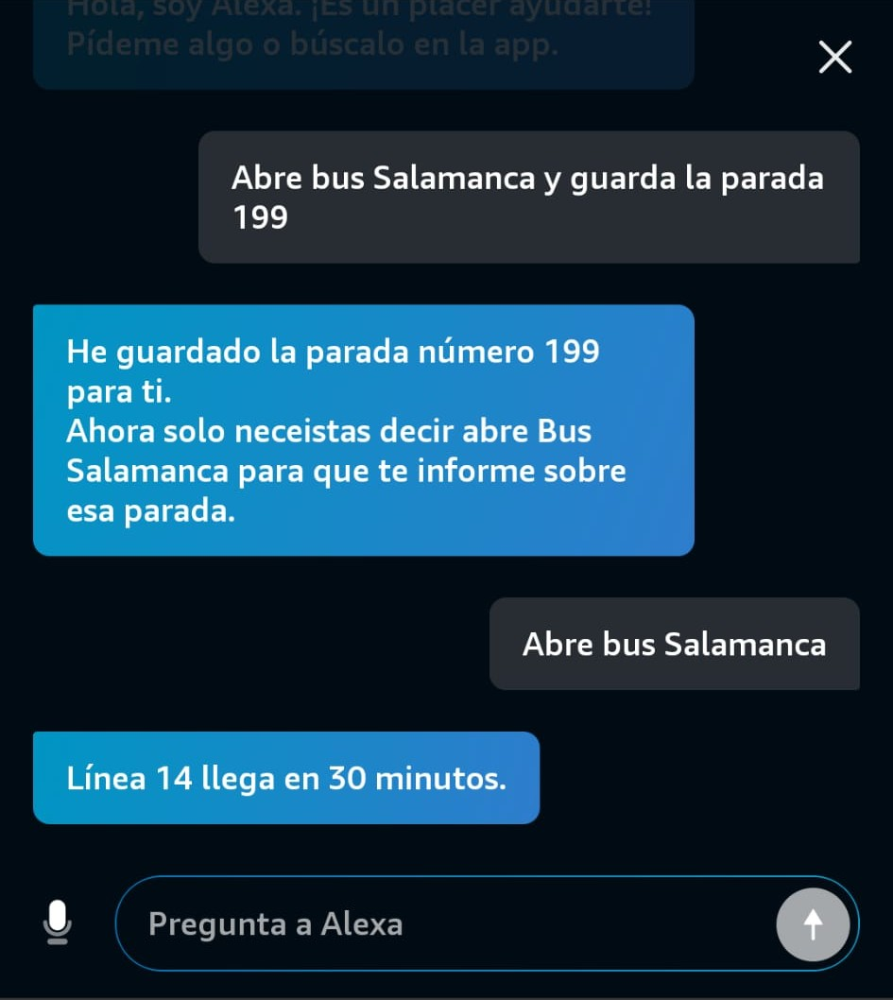
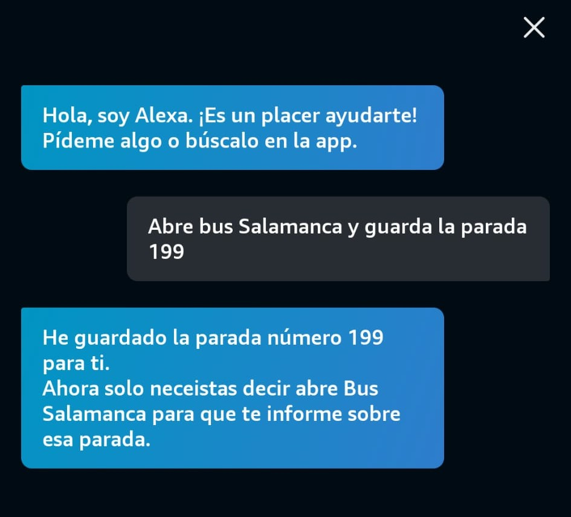
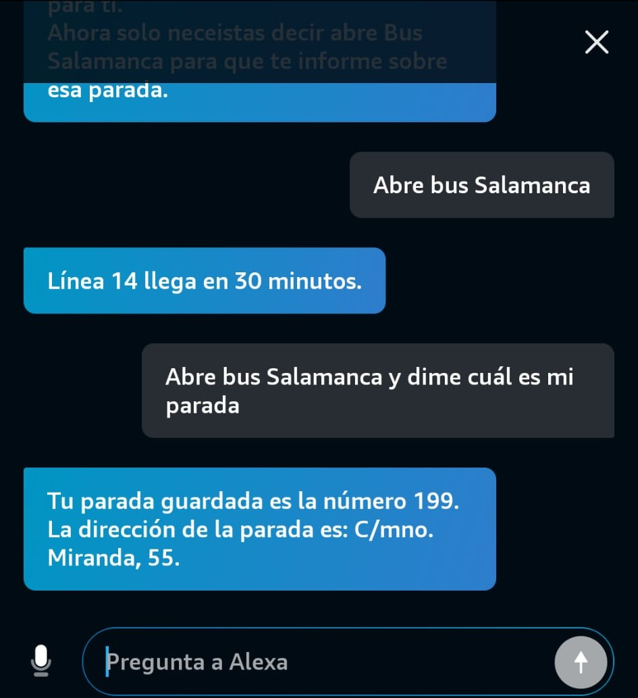

## Introducción

Recientemente he desarrollado una skill de Alexa que me permite consultar desde casa cuántos minutos faltan para que llegue el próximo autobús a la parada más cercana. Esta solución surgió de una necesidad personal, ya que últimamente tengo que desplazarme con frecuencia al centro de Salamanca y quería optimizar mis tiempos de espera.

## Proceso y Arquitectura

Al principio, exploré los sistemas rápidos para crear skills de Alexa, pero la mayoría utilizan Node.js 16, una versión ya deprecada. Por ello, decidí desplegar toda la infraestructura por mi cuenta utilizando servicios de AWS.

La arquitectura es sencilla y eficiente:

- **AWS Lambda**: Una función Lambda centraliza toda la lógica y responde a las peticiones de la skill de Alexa.
- **DynamoDB**: Utilizo una base de datos DynamoDB para almacenar información relevante y agilizar las consultas.
- **CloudWatch**: Configuré CloudWatch para monitorizar errores y el uso de la Lambda.
- **Alertas automáticas**: Implementé reglas que me notifican si se superan las 100,000 llamadas semanales a Lambda, para controlar el uso de la capa gratuita de AWS.

## Obtención de los datos

Para obtener la información de los autobuses, descubrí unas APIs que ofrecen los datos en tiempo real. No he contactado con la empresa de transportes urbanos de Salamanca, pero me gustaría notificarles en el futuro y espero que no haya inconvenientes para publicar una skill sobre sus servicios.

## Herramientas utilizadas

Durante el desarrollo, utilicé herramientas como **HTTP Toolkit** y **Telerik Fiddler** para interceptar y analizar las llamadas a las APIs, lo que facilitó la integración y depuración del sistema.

HTTP Toolkit era más sencilla, pero la opción de exportar la petición para nodejs era de pago, por lo que utilicé los 10 días de prubea de Telerik Fiddle.

## Consideraciones y limitaciones

Cabe destacar que, al depender de servicios públicos, a veces la información puede no estar disponible o presentar errores, algo que también he notado en aplicaciones oficiales que usan el mismo sistema. Mi skill podría verse afectada por estas mismas limitaciones.
Esto lo he visto con línas de autbús que desaparecen y vuelven a aparecer, o que no tienen información de tiempo real. En estos casos, la skill devuelve un mensaje indicando que no hay información disponible.

## Futuro y publicación

El proyecto es sencillo y útil, y tengo intención de publicarlo en GitHub próximamente para que otros usuarios puedan beneficiarse de él o adaptarlo a sus necesidades.

---

Si tienes preguntas o sugerencias sobre este proyecto, no dudes en dejar un comentario. ¡Espero que esta solución resulte útil para más personas!

