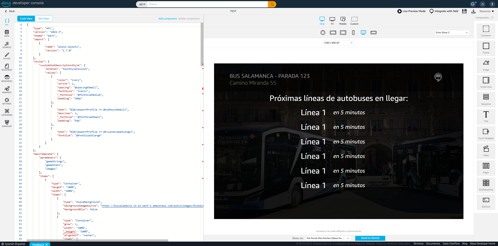

# Mejorando la Skill de Alexa Bus Salamanca

En este post comparto las mejoras realizadas en la skill de Alexa "Bus Salamanca", así como algunos aprendizajes y retos encontrados durante el proceso.

---

## Automatización del despliegue

- Añadí un **GitHub Workflow** para desplegar automáticamente en AWS Lambda, incluyendo el control de credenciales mediante IAM.
- Ahora existen dos Lambdas: una para _dev_ y otra para _prod_.
- Los errores de AWS han sido muy descriptivos cuando los roles no funcionaban, lo que me permitió solucionarlos rápidamente.

---

## Gestión de entornos

- Aprendí que tener dos entornos (_dev_ y _prod_) en la skill es sencillo.
- Para publicar la skill de desarrollo, hay que indicar la Lambda de producción.

---

## Mejoras en la interfaz gráfica (APL de Alexa)

- Utilicé **APL de Alexa** para mejorar la interfaz gráfica de la skill.
- La interfaz se adapta a diferentes dispositivos, como el Echo Spot (pantalla circular pequeña) y otros dispositivos más grandes como el Echo Show.
- Ahora la información útil se muestra de forma clara, requiriendo hacer scroll solo si es necesario.

- Usé la **Alexa Developer Console** para diseñar la interfaz gráfica y asegurarme de que se adapta perfectamente a los diferentes dispositivos.

- También mejoré la pantalla inicial cuando no hay datos, solicitando la parada e indicando comandos de voz para consultar cualquier parada.

- Así se ven las próximas líneas de autobús:

---

## Consideraciones técnicas

- Descubrí que la Lambda se ejecuta en otro huso horario, por lo que es necesario adaptarse a ello.
- Tras conseguir la primera aprobación de la skill, la segunda apenas tardó una hora en ser aprobada.

---

## Experiencia de usuario

- Dediqué más tiempo a probar la skill para poder añadir mejores recomendaciones en dispositivos como el Echo Show, por ejemplo, recomendar consultar el autobús una vez guardada la parada.
- Mejoré el estado inicial la primera vez que se muestra la skill, para solicitar la información de forma más intuitiva.

---

## Optimización y robustez

- Intenté optimizar la skill, pero hay dos puntos principales difíciles de mejorar: contactar con el servicio externo y transformar el XML en JSON.
- Mejoré la información que se muestra en caso de que el servicio no responda o no haya datos, evitando que la skill se quede colgada y proporcionando siempre una respuesta al usuario.

---

## Diferenciación de entornos

- Añadí una forma sencilla de saber si la skill es _dev_ o _prod_, añadiendo un emoji al título de las cards que se muestran en pantalla.

---

## Reflexión final

Estoy considerando publicar el código en GitHub, pero no tengo claro si es legal hacerlo, ya que la API de Salamanca no es pública y no sé si puedo compartirla.

---

Puedes probarla desde aquí [Bus Salamanca en Amazon Alexa](https://www.amazon.es/Juan-Manuel-B%C3%A9c-Bus-Salamanca/dp/B0F59TDK93/)