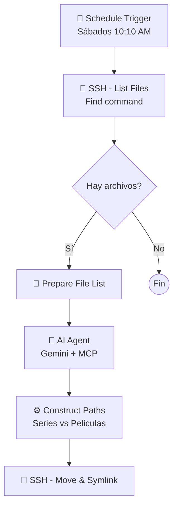

# Organiza Automáticamente tus Series y Películas con n8n e IA

¿Tu carpeta de descargas es un desastre? Organizar multimedia para Jellyfin o Plex puede ser una tarea tediosa. En este artículo, compartiré un flujo de trabajo de n8n que automatiza todo esto utilizando IA para distinguir entre películas y series, obteniendo metadatos y moviendo los archivos a las carpetas correctas (`/Series` o `/Peliculas`), todo mientras mantiene enlaces simbólicos (symlinks) para tus clientes P2P.

---

## El Flujo de Trabajo en n8n

Aquí tienes una vista general de cómo funciona la automatización:



---

## Paso a Paso: Analizando la Automatización

### 1. El Disparador (Trigger)
Empezamos con un **Schedule Trigger** que se ejecuta periódicamente (por ejemplo, todos los sábados a las 10:10 AM). Esto evita que el sistema esté comprobando constantemente y permite procesar lotes de descargas.

### 2. Listado Inteligente de Archivos (SSH)
Accedemos al servidor vía SSH y utilizamos un comando `find` muy específico para listar solo lo que nos interesa:

```bash
find /mnt/hdd_cache/share/public/amule/ /mnt/hdd_cache/share/public/torrent/complete/ -maxdepth 1 -type f -not -type l -not -name "*.nfo" -not -iname "*xubuntu*" -not -iname "*adobe*"
```

**Puntos clave:**
*   `-type f`: Solo buscamos archivos, no directorios.
*   `-not -type l`: **Ignoramos enlaces simbólicos**. Esto es crucial para no procesar archivos que ya han sido organizados anteriormente.
*   `-not -iname "*xubuntu*"...`: Filtramos nombres específicos que sabemos que no son multimedia (distros de Linux, software), optimizando el uso de la IA.

### 3. El Cerebro: Agente de IA con MCP
Aquí es donde ocurre la magia. Usamos un **AI Agent** conectado a un modelo **Google Gemini Chat**.

Para potenciar la IA, utilizamos el servidor **mcp-imdb**, una herramienta que permite consultar bases de datos de películas.
> **Nota:** He actualizado el servidor MCP para soportar Docker. Puedes encontrar mi fork aquí: [JuanmanDev/mcp-imdb](https://github.com/JuanmanDev/mcp-imdb/) y el original [aquí](https://github.com/clsung/mcp-imdb).

El prompt le pide a la IA que analice cada nombre de archivo y determine:
*   Si es **Película** o **Serie**.
*   Si es Serie, extrae el **Nombre limpio de la serie** y el **Número de temporada**.

Esto es mucho más robusto que usar expresiones regulares (Regex), ya que la IA entiende que "House.M.D.S01..." corresponde a la serie "House", Temporada 1.

### 4. Movimiento Inteligente y Symlinks
Una vez que la IA nos devuelve los datos estructurados (JSON), un nodo de código construye las rutas de destino:
*   **Series:** `/mnt/hdd_cache/Series/{NombreSerie}/Temporada {Numero}/archivo`
*   **Películas:** `/mnt/hdd_cache/Peliculas/archivo`

Finalmente, el nodo **SSH - Move & Symlink** ejecuta el movimiento. Pero no es un movimiento normal:

```bash
mkdir -p "$DEST_DIR" && mv "$SOURCE" "$DEST" && ln -s "$DEST" "$SOURCE"
```

**¿Por qué usar Symlinks?**
Si estás compartiendo el archivo en un cliente Torrent o aMule (seeding), mover el archivo rompería la ruta y detendría la compartición.
Al mover el archivo a su carpeta organizada y crear inmediatamente un **enlace simbólico** en la ubicación original apuntando al nuevo destino:
1.  Jellyfin/Plex tiene el archivo limpio y organizado.
2.  Tu cliente P2P sigue viendo el archivo en la carpeta de descargas (a través del enlace) y puede seguir compartiéndolo.

---

## Aviso Legal
Esta guía es solo para fines educativos y de organización de medios y copias de seguridad personales. No apoyo ni recomiendo el uso de contenido ilegal o pirateado. Por favor, utiliza servicios de streaming legales o compra tus medios. Si descargas contenido de dominio público o Creative Commons, esta herramienta te será de gran utilidad.
