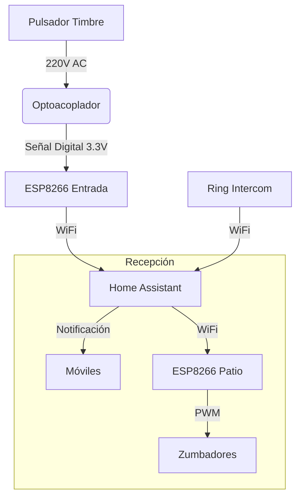
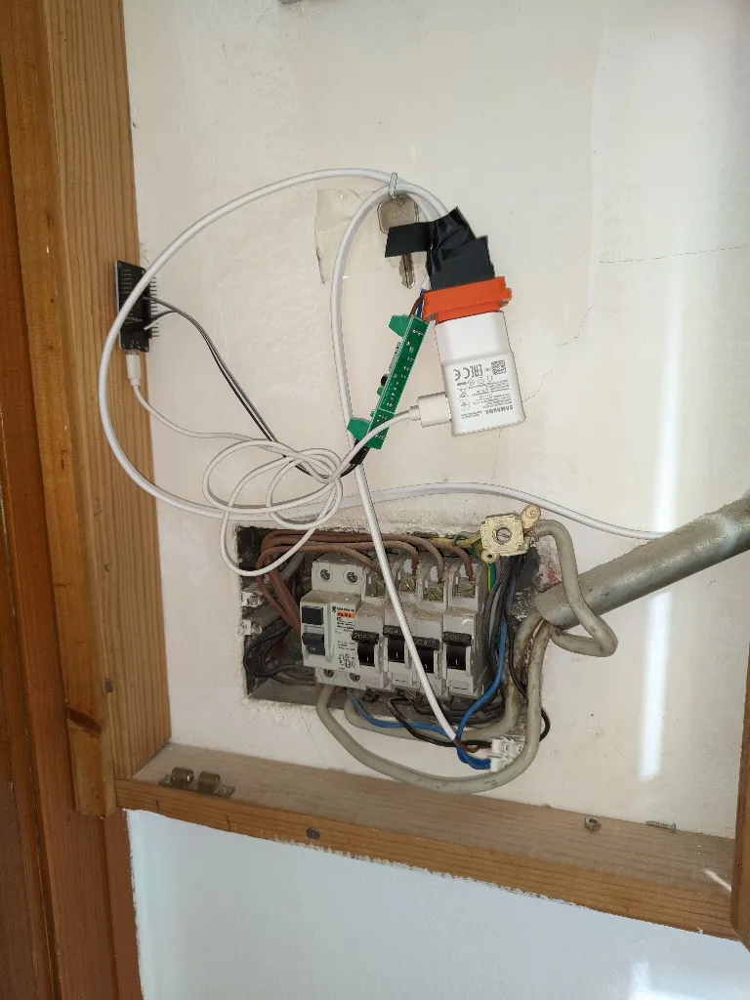
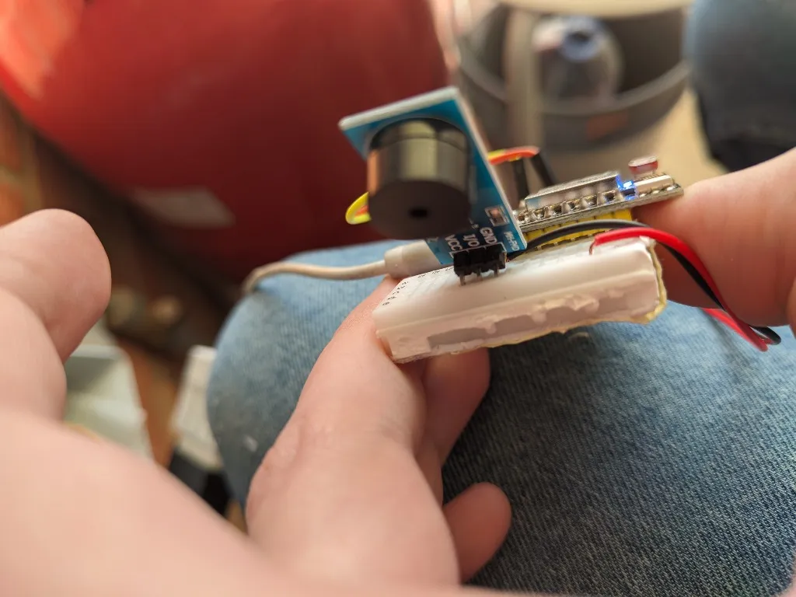
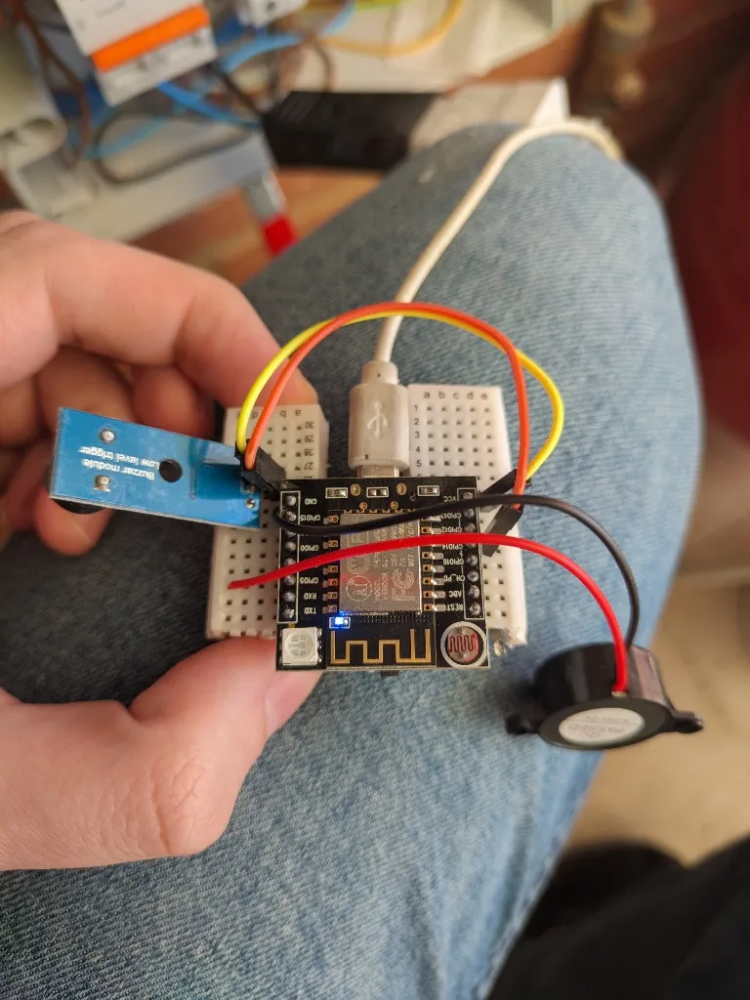
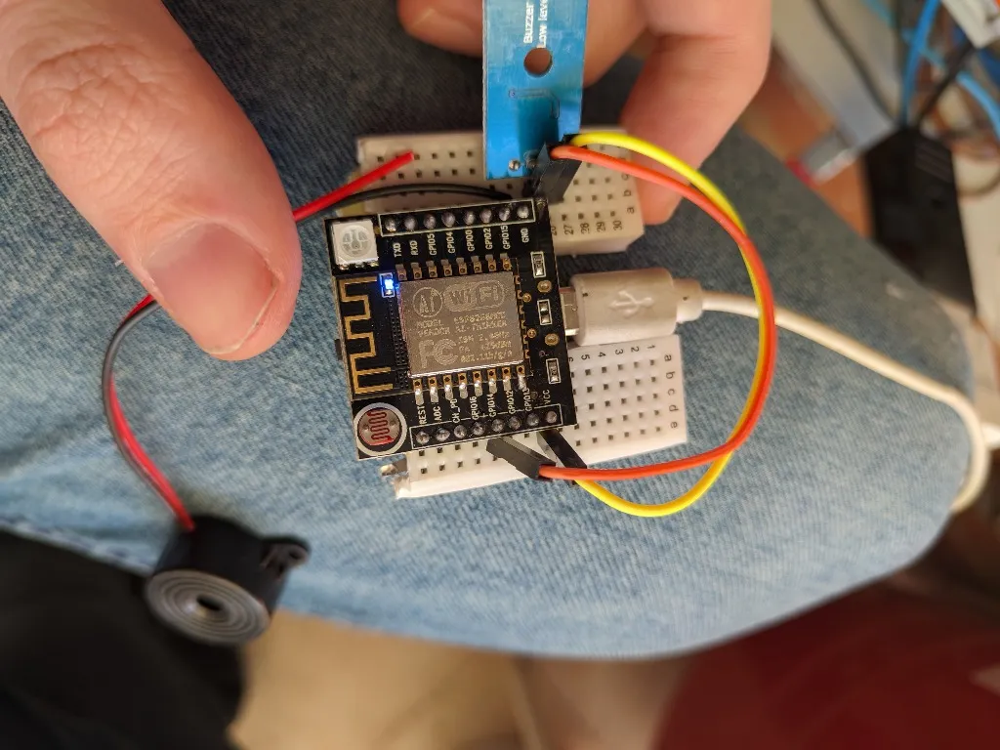

# Timbre Inteligente: No pierdas ninguna visita

¿Alguna vez te ha pasado que estás en el patio, poniendo la lavadora o simplemente lejos de la puerta y no escuchas el timbre? A mí me pasaba constantemente. Mi casa es grande y cuando estoy en la zona de lavandería, el sonido del timbre principal simplemente no llega. 

Para solucionar esto, he montado un sistema que no solo me avisa al móvil cuando alguien llama, sino que también replica el sonido en el patio mediante unos zumbadores.

## El Problema

El sistema eléctrico de la casa es un poco antiguo, y cambiar todo el cableado del timbre no era una opción sencilla. Necesitaba una solución que se integrara con lo que ya tenía sin requerir obras mayores. El objetivo principal era detectar cuándo alguien pulsaba el timbre y actuar en consecuencia.

## La Solución

La solución consta de varios componentes integrados en Home Assistant:

1.  **Detección del Timbre**: Un ESP8266 detecta cuando suena el timbre mediante un optoacoplador.
2.  **Notificaciones**: Home Assistant envía notificaciones a nuestros móviles.
3.  **Extensión de Sonido**: Otro ESP8266 en el patio hace sonar unos zumbadores.
4.  **Integración Adicional**: Un Ring Intercom para el telefonillo de la calle.

### Diagrama del Sistema



## Hardware Utilizado

### 1. Detector del Timbre (Entrada)
Para detectar la pulsación del timbre, que funciona a 220V, utilicé un **optoacoplador**. Este componente aísla eléctricamente el circuito de alta tensión del ESP8266, protegiendo la electrónica.

*   **Placa**: ESP8266 (Witty Cloud)
*   **Sensor**: Optoacoplador conectado a los cables del timbre (Línea y Neutro del zumbador antiguo).
*   **Conexión**: Cuando el timbre suena, el optoacoplador envía una señal LOW al GPIO18.



### 2. Extensor de Sonido (Patio)
En el patio, donde no se oye el timbre, instalé otro ESP8266 con un módulo de zumbadores.

*   **Placa**: ESP8266 (Modelo ESP-01 o similar en placa de desarrollo).
*   **Actuadores**: Zumbadores (Buzzers) activos/pasivos conectados a GPIO5 y GPIO14.
*   **Funcionalidad**: Reproduce diferentes patrones de pitidos (cortos, largos, secuencias) según la alerta.



## Configuración ESPHome

Aquí tienes la configuración clave para el **ESP de la Entrada**. Usamos un filtro `delayed_off` para estabilizar la señal pulsante de la corriente alterna.

```yaml
binary_sensor:
  - platform: gpio
    pin:
      number: GPIO18
      mode: INPUT_PULLUP
      inverted: true
    name: "Timbre Rellano"
    filters:
      # Ignora los pulsos de la CA y mantiene el estado "ON"
      - delayed_off: 5ms
```

Y para el **ESP del Patio**, definí varios scripts para tener distintos tonos de aviso. Por ejemplo, un pitido doble:

```yaml
output:
  - platform: esp8266_pwm
    pin: GPIO5
    id: output_buzzer_redondo
    frequency: 1000Hz

script:
  - id: beep_doble_40ms
    mode: restart
    then:
      - output.turn_on: output_buzzer_redondo
      - delay: 40ms
      - output.turn_off: output_buzzer_redondo
      - delay: 150ms
      - output.turn_on: output_buzzer_redondo
      - delay: 40ms
      - output.turn_off: output_buzzer_redondo
```



## Automatización en Home Assistant

Una vez que los dispositivos están en Home Assistant, la automatización es sencilla. Cuando el sensor del timbre pasa a `on`, enviamos notificaciones y activamos los zumbadores del patio.

```yaml
alias: Notificación Timbre
trigger:
  - platform: state
    entity_id: binary_sensor.entrada_privada_timbre_rellano
    to: "on"
action:
  # Notificar a móviles
  - service: notify.mobile_app_todos
    data:
      title: "🔔 ¡Timbre Rellano!"
      message: "Alguien está en la puerta."
  
  # Sonar zumbador en el patio
  - service: script.turn_on
    target:
      entity_id: script.beep_triple_largo
```

## Conclusión

Con componentes muy económicos y un poco de configuración en ESPHome, he solucionado el problema de no escuchar el timbre. Además, al integrarlo con el **Ring Intercom**, tengo control total tanto de la puerta de la calle como de la puerta del piso, pudiendo incluso abrir remotamente si es necesario.


