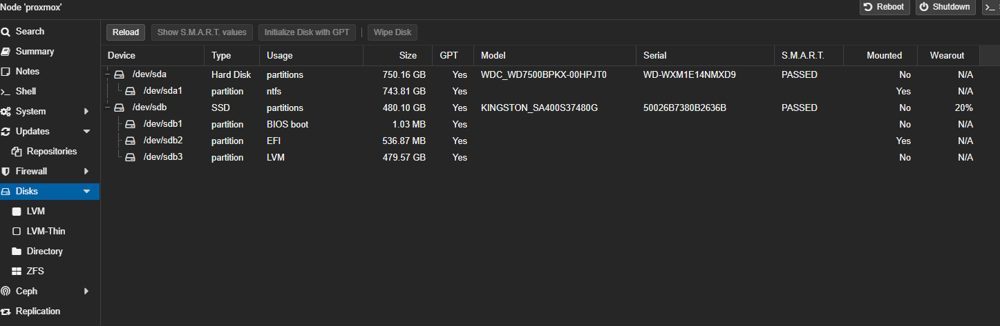
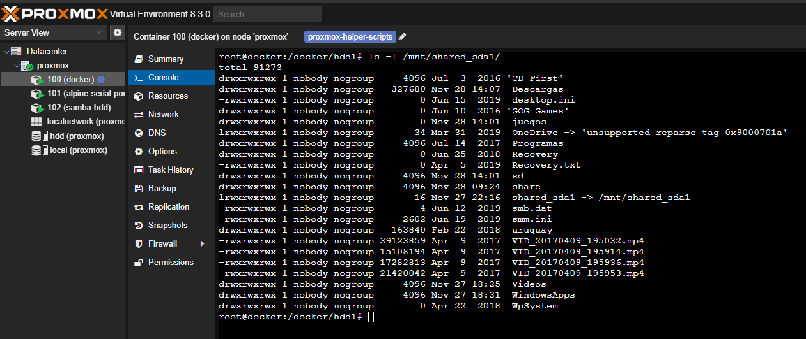
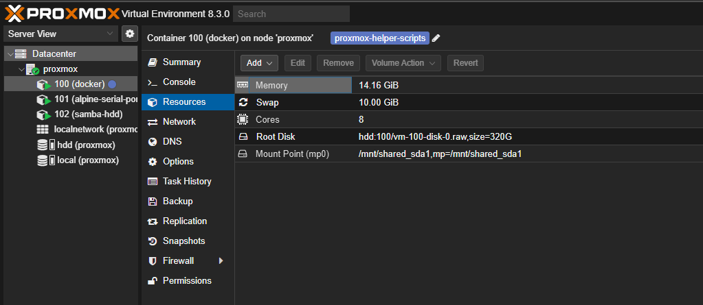
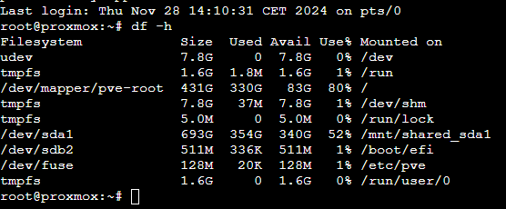

# La situación

Tengo un antiguo ordenador en casa funcionando como un pequeño servidor que está encendido todo el día. Allí tengo algunos servicios como **Home Assistant** o **Frigate** para grabar las cámaras de seguridad. También lo uso como sistema de descargas para obtener ISOs de Linux por torrent, entre otras cosas.

Utilizo **Proxmox** y **Docker** para gestionarlo todo.

# El problema

Todo el sistema está alojado en un único **SSD SATA3 de 480 GB** que tiende a llenarse rápidamente. Cuando esto sucede, casi nada funciona: desde la interfaz web de Proxmox solo puedo observar cómo todo comienza a fallar. Esto me obliga a borrar archivos de forma manual para liberar espacio.

## Soluciones rápidas

Borrar logs, imágenes de Docker no utilizadas y otros archivos temporales ha funcionado hasta ahora. Sin embargo, es una solución temporal y el problema vuelve a ocurrir con el tiempo.

# Una solución a largo plazo

Mi servidor tiene un **HDD de 750 GB** conectado que no estaba utilizando. Inicialmente, no lo consideré debido a que parecía lento y en mal estado, pero tras revisarlo confirmé que está en buen estado y puedo aprovecharlo.

### Estado actual en Proxmox

Este es el disco en **Proxmox**:



El disco está montado en Proxmox y es accesible:  

  

Para utilizarlo en un contenedor **LXC**, necesito compartir un punto de montaje.

> ⚠️ **Importante:** Elige un nombre adecuado para la ruta compartida, ya que deberá ser el mismo en todos los entornos virtuales que utilicen ese recurso (LXC/Docker).

## Montar un disco en un contenedor LXC

1. **Detén el contenedor:**  
   Sustituye `100` por el ID de tu contenedor.
   ```shell
   pct stop 100
   ```
2. **Edita su archivo de configuración:**  
   ```shell
   nano /etc/pve/lxc/100.conf
   ```
3. **Añade el punto de montaje:**  
   Asegúrate de usar la misma ruta tanto en el host como en el contenedor. En mi caso, `/mnt/shared_sda1`:
   ```
   mp0: /mnt/shared_sda1,mp=/mnt/shared_sda1
   ```
4. **Inicia el contenedor:**
   ```shell
   pct start 100
   ```
5. **Verifica el acceso desde el contenedor:**  
   Comprueba que puedes acceder a los archivos desde el contenedor:

     
     

¡Listo! Ahora tienes más espacio disponible en el LXC. 🥳

## Usar el espacio en Docker

Para aprovechar este espacio en Docker, es necesario mover las carpetas más utilizadas al HDD y crear un enlace simbólico. Aquí tienes un script para hacerlo de forma sencilla:

### Script para mover carpetas y crear enlaces simbólicos

```bash
#!/bin/bash

# Rutas
ORIGEN="/docker/share"
DESTINO="/docker/hdd1/share"

# Crear carpeta destino si no existe
mkdir -p "$DESTINO"

# Copiar archivos y carpetas
cp -ru "$ORIGEN/." "$DESTINO/"

# Verificar éxito de la copia
if [ $? -eq 0 ]; then
    echo "Archivos copiados con éxito. Eliminando carpeta original..."
    rm -rf "$ORIGEN"

    # Crear enlace simbólico
    ln -s "$DESTINO" "$ORIGEN"
    echo "Enlace simbólico creado exitosamente."
else
    echo "Error al copiar archivos. No se eliminará la carpeta original."
    exit 1
fi
```

### Añadir el volumen al Docker Compose

Para que el enlace simbólico funcione correctamente en Docker, comparte el directorio del HDD en el archivo `docker-compose.yml`. Por ejemplo:

```yaml
volumes:
  - /mnt/shared_sda1:/mnt/shared_sda1
```

Ejemplo completo con un contenedor de Samba:

```yaml
name: samba

services:
  samba:
    image: ghcr.io/crazy-max/samba
    container_name: samba
    network_mode: host
    volumes:
      - "./samba.yml:/data/config.yml"
      - "/share:/samba/share"
      - "/docker:/samba/docker"
      - "/docker/hdd1:/samba/hdd1"
      - /mnt/shared_sda1:/mnt/shared_sda1
    environment:
      - "TZ=Europe/Paris"
      - "SAMBA_LOG_LEVEL=0"
    restart: unless-stopped
```

Reinicia los contenedores afectados para aplicar los cambios.

### Resultado final

Ahora, gracias al HDD adicional, tengo mucho más espacio disponible en mi servidor:  



Gracias por leer hasta aquí. 😊