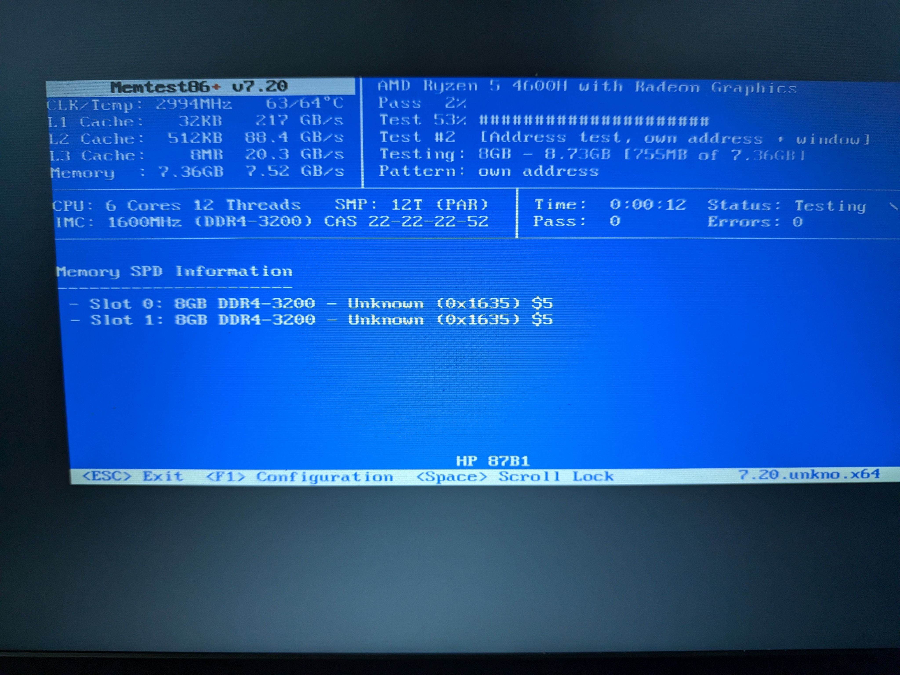

# El ordenador "muerto" que la IA consiguió resucitar

Recientemente, me enfrenté a uno de esos problemas de hardware/software que te hacen plantearte tirar un ordenador a la basura. Tenía un equipo (un HP Pavilion Gaming 15 con un AMD Ryzen 5 4600H) que, literalmente, **se apagaba de golpe a los 3 segundos de intentar arrancar cualquier sistema operativo moderno** (fuera Windows nativo, Linux o Proxmox). 

La única forma de conseguir que se mantuviera encendido era pasándole al kernel de Linux el parámetro `acpi=off` en el menú de GRUB. Pero claro, desactivar el ACPI en un equipo actual significa perder el control de energía, el multiprocesamiento, la gestión de temperatura y dejar un procesador de 12 hilos funcionando con un solo núcleo a una velocidad ridícula. Un servidor completamente inútil.

Como resolver esto a mano requería unos conocimientos de ingeniería inversa a nivel de BIOS y kernel asombrosos, decidí probar un enfoque distinto: **dejar que la Inteligencia Artificial hiciera el trabajo de diagnóstico avanzado.**

## La dinámica del equipo de salvamento

El proceso se convirtió en un trabajo en equipo extremo entre yo y varios agentes de IA (Gemini y Claude de Anthropic):

* **La IA investigaba:** A través del túnel SSH en el sistema rudimentario (con `acpi=off`), la IA iba ejecutando scripts para interactuar directamente con los puertos y registros de memoria del chipset, buscando qué causaba el fallo.
* **El Prompt de inicio:** Para poner a las IAs en contexto y no perder el tiempo con diagnósticos triviales, los prompts tenían que ser extremadamente técnicos e incluir credenciales para automatizar el proceso. Por ejemplo:
  > *"Tengo un servidor Proxmox (HP Pavilion con Ryzen 5). Se apaga instantáneamente a los 3 segundos de cargar el kernel a menos que use `acpi=off`. Hemos descartado temperatura y daño en la CPU. Quiero aislar qué instrucción ACPI o puerto causa el apagado por hardware. Estamos conectados por SSH en modo `acpi=off`. La IP es 192.168.2.102, usuario 'root' y contraseña 'P4ssw0rd!'. Genera e instala una clave SSH para que puedas reconectarte de manera directa y continua tras cada reinicio físico sin pedirme la contraseña. ¿Qué comandos `inb`/`outb` o lecturas de memoria MMIO podemos lanzar para sondear los puertos físicos (PM_TIMER, SMI, APIC) y provocar el fallo manualmente?"*
* **El servidor colapsaba:** Cada vez que la IA intentaba activar manualmente los subsistemas de energía (el ACPI) mediante sondas a nivel de hardware, el servidor se apagaba instantáneamente como si le hubieran quitado la batería y la sesión SSH de la IA se caía.
* **El humano corregía y reiniciaba:** Las IAs no siempre daban con la tecla a la primera. A menudo me sugerían configuraciones para el GRUB que tenían sintaxis incorrecta o no aplicaban bien el parche. Yo tenía que revisar, arreglar la opción del GRUB, cruzar los dedos, reiniciar físicamente la máquina y observar el comportamiento para retroalimentar a la IA.



## Las pruebas fallidas y la rendición de Gemini

La fase de investigación fue brutal. Empezamos descartando el hardware básico. Windows moría. Proxmox moría. Sin embargo, herramientas pre-OS como Memtest86+ v7 sobrevivían perfectamente ejecutando 12 hilos durante minutos, lo que nos indicaba que el procesador no estaba dañado.

Comenzamos la batería de pruebas de software:
1. Intentamos usar `acpi=ht`. El sistema moría. Más tarde descubriríamos (tras investigar el código fuente del kernel) que este parámetro fue eliminado en la versión 2.6.35 y ahora se ignora en silencio, por lo que estábamos arrancando con el ACPI completo sin saberlo.
2. Extrajimos las tablas ACPI originales de la máquina, las descompilamos, modificamos las DSDT y FACP (poniendo `SMI_CMD=0`) y las reinyectamos a través de un `initrd` modificado. El sistema moría.
3. Intentamos hacer una lista negra de módulos con `initcall_blacklist=acpi_init`. El sistema moría.

Llegados a este punto de desesperación tras docenas de reinicios físicos, **Gemini se rindió**. El modelo empezó a dar vueltas en bucle y no lograba salir de las mismas recomendaciones estériles. 

Fue entonces cuando **Claude (Anthropic) tomó las riendas** y sugirió un enfoque mucho más agresivo: sondear los puertos en vivo.

## El descubrimiento del verdadero culpable: El Firmware

Arrancamos en modo `acpi=off` (donde la máquina era estable) y, por SSH, empezamos a leer y escribir directamente en el hardware mediante comandos `inb` / `outb`. 

* Sondamos la zona ECAM (leyendo registros MMIO de 30 dispositivos PCIe). El servidor sobrevivió.
* Sondamos el HPET, APIC y PM_TIMER. El servidor sobrevivió.
* Escribimos directamente en el registro de control `SCI_EN=1` (puerto `0x804`). El servidor sobrevivió.

Finalmente, Claude propuso ejecutar el comando exacto que usa el kernel de Linux para pedirle a la placa base que pase el control de la energía al sistema operativo. Ejecutamos:
`outb 0xA0 0xB2` (Enviar el valor 0xA0 al puerto SMI 0xB2).

**¡PUM! Apagado instantáneo.** 

Habíamos encontrado la causa raíz confirmada experimentalmente. El problema era un fallo de diseño a nivel de placa base bastante insólito: **el manejador SMM (System Management Mode) de la BIOS que procesa el comando ACPI_ENABLE estaba roto**. Al recibir el comando estándar que envía todo sistema operativo moderno, la BIOS entraba en pánico y cortaba la corriente por completo.

## El parche mágico: Pre-activar ACPI desde GRUB

Sabiendo esto, necesitábamos que Linux no enviara ese comando mortal. La especificación ACPI dice que si el bit `SCI_EN` ya está activo cuando arranca el kernel, este asume que el hardware ya está en modo ACPI y **omite** enviar el comando SMI.

Aquí es donde mi intervención manual fue crítica. Tras pulir las sugerencias de la IA, diseñamos una solución definitiva. Creamos un nuevo script en `/etc/grub.d/09_scifix` para generar automáticamente una entrada de arranque parcheada que sobreviviera a las actualizaciones del kernel de Proxmox:

```bash
#!/bin/sh
exec tail -n +3 $0
# Este archivo provee un parche ACPI SCI_EN para HP Pavilion
# Recuerda darle permisos: chmod +x /etc/grub.d/09_scifix

echo "Generando menú Proxmox con parche ACPI SCI..." >&2

cat << EOF
menuentry 'Proxmox VE (ACPI SCI fix - 12 cores)' --class proxmox --class gnu-linux --class gnu --class os {
    insmod part_gpt
    insmod ext2
    insmod lvm
    insmod iorw
    
    # EL PARCHE MÁGICO: Pre-activar ACPI enviando 1 al puerto 0x804
    outw 0x804 0x1
    
    # Cargar el kernel normal (asegúrate de adaptar las rutas a tu LVM/UUID)
    linux /boot/vmlinuz-6.8.4-2-pve root=/dev/mapper/pve-root ro quiet
    initrd /boot/initrd.img-6.8.4-2-pve
}
EOF
```

Para aplicarlo de forma permanente:
1. Le dimos permisos de ejecución: `chmod +x /etc/grub.d/09_scifix`.
2. Configuramos el arranque por defecto en `/etc/default/grub` añadiendo `GRUB_DEFAULT="Proxmox VE (ACPI SCI fix - 12 cores)"`.
3. Ejecutamos `update-grub`.


De este modo, GRUB pre-activa el bit en el puerto `0x804`. Cuando Proxmox arranca, detecta que la máquina ya se encuentra en modo ACPI, se salta la instrucción fatal y **arranca perfectamente con sus 12 hilos, control de energía completo y total estabilidad**.

## La sorpresa física extra

Durante la investigación, sí descubrimos un problema de hardware real y paralelo.


Al abrir el portátil e intercambiar la RAM, confirmamos que **el canal B (el slot 2 de la memoria RAM) estaba completamente muerto en la placa**. Los módulos estaban sanos, pero la placa era incapaz de utilizarlos en ese zócalo. Un fallo físico que, curiosamente, no estaba relacionado con los apagones aleatorios, pero que limitaba el servidor a usar solo 8 GB de RAM.

Gracias a la persistencia brutal y la sinergia entre un humano cabezota reiniciando servidores y un Claude brillante dictando pruebas al hardware puro, pudimos aislar un fallo de firmware que habría llevado a cualquiera a tirar la máquina a la basura, logrando rescatar un portátil y convertirlo en un servidor Proxmox totalmente funcional.
