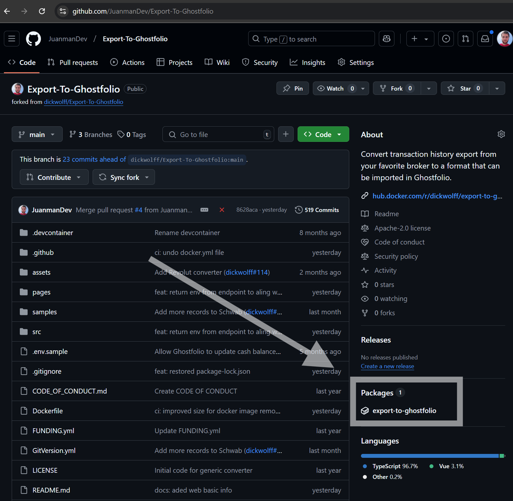
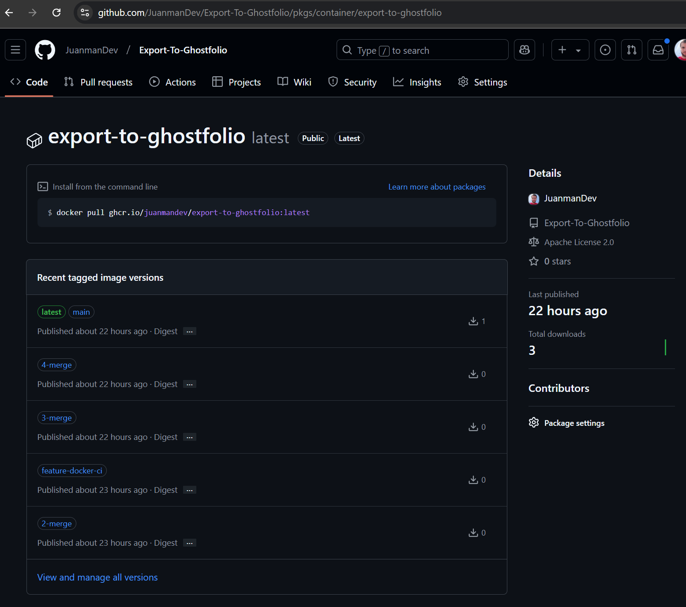
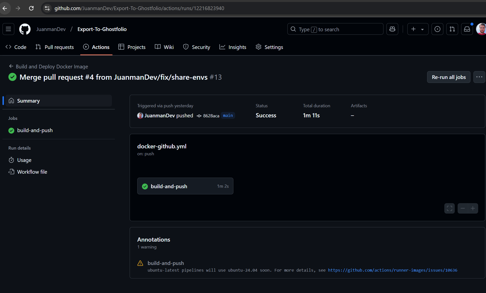
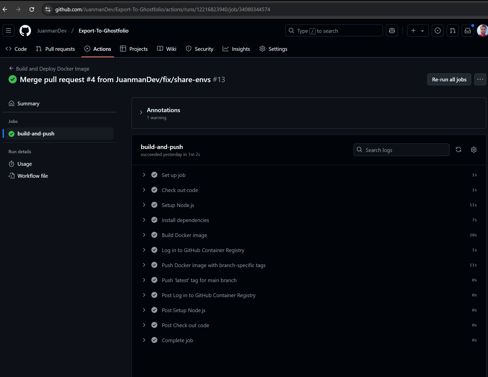

# Cómo generar una imagen de Docker desde GitHub

Existen numerosos tutoriales en línea sobre cómo desplegar una imagen de Docker en GitHub.

GitHub ofrece la posibilidad de hospedar imágenes de Docker en su propio registro, aunque es importante tener en cuenta el número total de descargas.

Últimamente he hecho fork a varios proyectos en los que deseaba generar una imagen de Docker de forma rápida, como por ejemplo: [bolt](https://github.com/JuanmanDev/bolt.new-any-llm-1/) y [export-to-goshtfolio](https://github.com/JuanmanDev/Export-To-Ghostfolio). Para agilizar esta tarea, he creado un script genérico que se ejecuta en GitHub Actions (el sistema de CI/CD de GitHub) para generar la imagen de forma sencilla:

```yml
name: Build and Deploy Docker Image to Github Registry

on:
  push:
    branches:
      - main
      - feature/docker*
      - feature/add-docker*
  pull_request:
    branches:
      - main
      - feature/docker*
      - feature/add-docker*

jobs:
  build-and-push:
    runs-on: ubuntu-latest

    steps:
      # Paso 1: Clonar el repositorio
      - name: Check out code
        uses: actions/checkout@v3

      # Paso 2: Configurar Node.js versión 22
      - name: Setup Node.js
        uses: actions/setup-node@v3
        with:
          node-version: 22
          cache: 'npm'

      # Paso 3: Instalar dependencias
      - name: Install dependencies
        run: npm install

      # Paso 4: Construir la imagen de Docker utilizando un script de npm
      - name: Build Docker image
        run: |
          REPO_NAME=$(echo "${{ github.repository }}" | awk -F '/' '{print $2}' | tr '[:upper:]' '[:lower:]')
          docker build -t $REPO_NAME:latest .

      # Paso 5: Iniciar sesión en el registro de contenedores de GitHub
      - name: Log in to GitHub Container Registry
        uses: docker/login-action@v2
        with:
          registry: ghcr.io
          username: ${{ github.actor }}
          password: ${{ secrets.GITHUB_TOKEN }}

      # Paso 6: Etiquetar y subir la imagen de Docker con una etiqueta específica de la rama
      - name: Push Docker image with branch-specific tags
        run: |
          REPO_NAME=$(echo "${{ github.repository }}" | awk -F '/' '{print $2}' | tr '[:upper:]' '[:lower:]' | sed 's/[^a-z0-9._-]/-/g')
          REPO_OWNER=$(echo "${{ github.repository_owner }}" | tr '[:upper:]' '[:lower:]')
          IMAGE_NAME=ghcr.io/$REPO_OWNER/$REPO_NAME

          # Sanear el nombre de la rama para que sea compatible con Docker
          SANITIZED_BRANCH_NAME=$(echo "${{ github.ref_name }}" | sed 's/[^a-zA-Z0-9._-]/-/g')

          docker tag $REPO_NAME:latest $IMAGE_NAME:$SANITIZED_BRANCH_NAME
          docker push $IMAGE_NAME:$SANITIZED_BRANCH_NAME

      # Paso 7: Subir la etiqueta 'latest' solo en la rama main
      - name: Push 'latest' tag for main branch
        if: github.ref == 'refs/heads/main'
        run: |
          REPO_NAME=$(echo "${{ github.repository }}" | awk -F '/' '{print $2}' | tr '[:upper:]' '[:lower:]' | sed 's/[^a-z0-9._-]/-/g')
          REPO_OWNER=$(echo "${{ github.repository_owner }}" | tr '[:upper:]' '[:lower:]')
          IMAGE_NAME=ghcr.io/$REPO_OWNER/$REPO_NAME

          docker tag $REPO_NAME:latest $IMAGE_NAME:latest
          docker push $IMAGE_NAME:latest
```

Al ejecutar este script, se generará automáticamente una imagen de Docker en el proyecto:






https://github.com/JuanmanDev/Export-To-Ghostfolio/actions/runs/12216823940


https://github.com/JuanmanDev/Export-To-Ghostfolio/actions/runs/12216823940/job/34080344574


## Siempre se puede mejorar
Una mejora interesante sería generar una versión en GitHub con notas de la versión. Esto podría lograrse utilizando[semantic-release](https://github.com/semantic-release/semantic-release)Por el momento, este script es suficiente para proyectos que requieran una imagen de Docker rápida y sencilla.

¡Espero que te haya resultado útil!