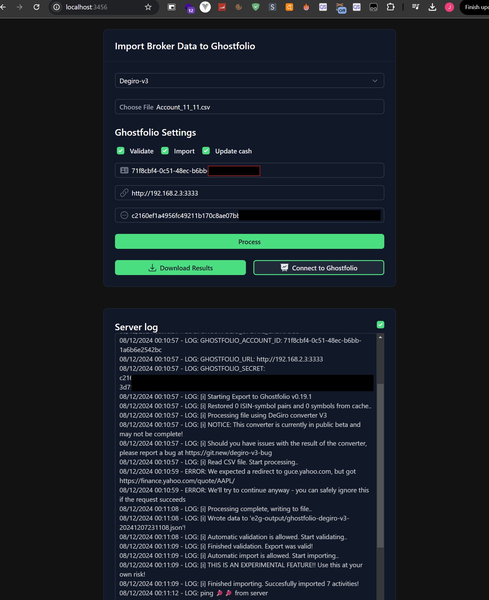

# Una interfaz web más sencilla que un comando CLI

Descubrí [Ghostfolio](https://ghostfol.io/en/start), un sistema para gestionar tus finanzas en tu propio servidor.

También encontré en GitHub otro proyecto para importar mis acciones desde Degiro a Ghostfolio:
[Export-To-Ghostfolio](https://github.com/dickwolff/Export-To-Ghostfolio/).

## Todo en un solo fin de semana

En apenas un fin de semana modifiqué el proyecto original.

La idea era migrar todo a una interfaz web, evitando la necesidad de un backend. Sin embargo, el procesamiento del CSV requería Node.js, así que por ahora lo he mantenido. Creé un servidor básico con Express.js y una interfaz en Nuxt para servirlo.

Falta mejorar el código, implementar pruebas y pulir muchos aspectos más. Pero, considerando que esto es el trabajo de tan solo dos días, estoy bastante satisfecho por ahora.

## Encuentra el código en GitHub

- [Mi versión del proyecto](https://github.com/JuanmanDev/Export-To-Ghostfolio/tree/main)
- [Pull Request al repositorio original](https://github.com/dickwolff/Export-To-Ghostfolio/pull/132)

# Vídeos

### Error si no has completado todos los campos:
<video controls src="./ExportToGhostfolio_NoSetShotfpholiaACcount.mp4" title="Title"></video>

### Sesión exitosa
<video controls src="./ExportToGhostfolio_AllFine.mp4" title="Title"></video>

# Anotaciones adicionales

Algunos problemas encontrados:

- Al exportar todos mis datos desde Degiro, ciertos registros se corrompen generando líneas vacías en el CSV. Ya he contactado con ellos.
- Algunas transacciones no están contempladas por el script original, por lo que tendré que modificarlo en el futuro.
- En el video aparecen mis tokens de acceso locales. Cuando entienda mejor Ghostfolio, eliminaré todo y crearé una nueva instancia con datos correctos.

¡Gracias!
