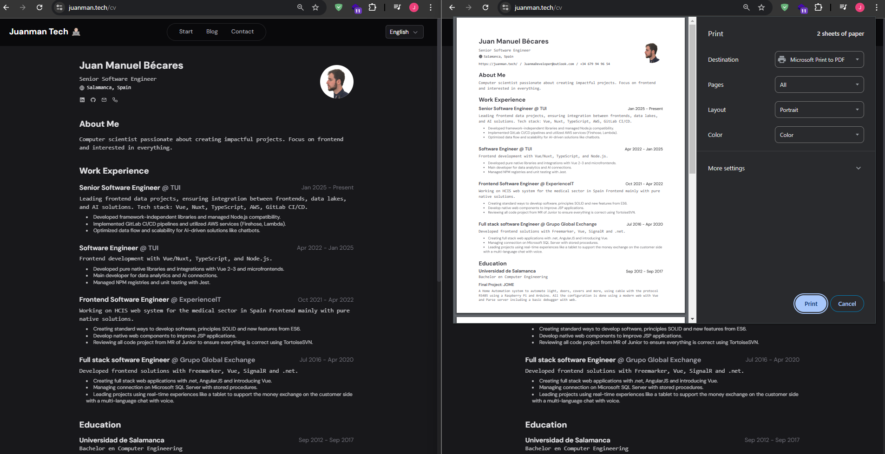

# Mi CV en línea con JSON Resume

Recientemente, he creado una página web para alojar mi currículum vitae en línea utilizando **[JSON Resume](https://jsonresume.org/)** como plantilla. Esta herramienta me ha permitido mantener mi CV actualizado de manera sencilla y eficiente.

## ¿Por qué JSON Resume?

JSON Resume es una herramienta que permite definir tu currículum en formato JSON, lo que facilita su actualización y mantenimiento. Además, existen múltiples plantillas disponibles que se pueden personalizar según tus necesidades.

## Personalización y Modo Oscuro

Para hacer mi CV más atractivo y accesible, tuve que realizar algunas actualizaciones en el estilo, especialmente para el **modo oscuro**. También decidí ocultar el header y el footer para que el contenido principal del CV sea lo más destacado.

### Pasos para crear tu CV con JSON Resume

1. **Define tu CV en formato JSON**: Utiliza el esquema de JSON Resume para estructurar tu información.
2. **Selecciona una plantilla**: Elige una de las plantillas disponibles en JSON Resume o crea la tuya propia.
3. **Personaliza el estilo**: Ajusta los estilos CSS para que se adapten a tus preferencias, incluyendo el modo oscuro.
4. **Oculta elementos innecesarios**: Si lo deseas, oculta el header y el footer para centrar la atención en el contenido principal.

## Ventajas de tener un CV en línea

- **Actualización rápida**: Puedes actualizar tu CV en cualquier momento y los cambios se reflejarán instantáneamente en la web.
- **Accesibilidad**: Tu CV estará disponible en línea, lo que facilita compartirlo con potenciales empleadores o colaboradores.
- **Personalización**: Puedes ajustar el diseño y el estilo para que se adapten a tu personalidad y preferencias.

## ¿Quieres ver mi CV?

Puedes visitar mi CV en línea en la siguiente dirección: [Mi CV - /cv](/es/cv).

## Agradecimientos

Quiero agradecer a Midu por compartir este recurso tan útil. Puedes ver su video explicativo aquí:

<iframe width="560" height="500" src="https://www.youtube.com/embed/Zwh92LTB-Bk?si=m4if9jfbMNBrKalq" title="YouTube video player" frameborder="0" allow="accelerometer; autoplay; clipboard-write; encrypted-media; gyroscope; picture-in-picture; web-share" referrerpolicy="strict-origin-when-cross-origin" allowfullscreen></iframe>

---

Espero que esta herramienta te sea útil y te inspire a crear tu propio CV en línea. ¡No dudes en compartir tus impresiones y sugerencias!