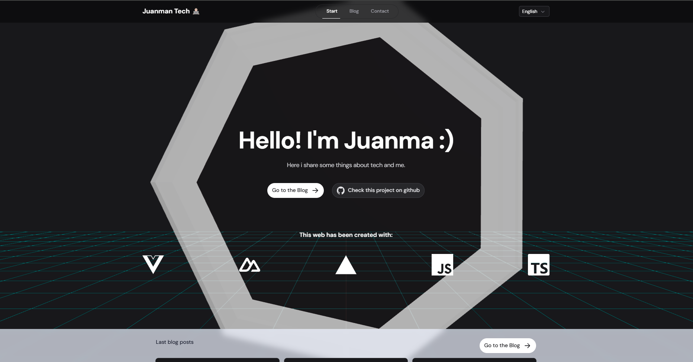

Durante la implementación de gráficos 3D en mi aplicación web utilizando TresJS, me encontré con un escenario interesante que merece ser compartido: la gestión de entornos sin soporte WebGL.

## Contexto y Aprendizaje

Mi journey comenzó con el excelente curso de [midudev sobre experiencias 3D con Vue](https://midu.dev/curso/experiencias-3d-con-vue), impartido por Alvaro Sabu. Para aquellos interesados en profundizar en la materia, recomiendo también el siguiente recurso de FireShip:

<iframe width="560" height="500" src="https://www.youtube.com/embed/Q7AOvWpIVHU?si=0O6dT7Zk9Vy9k-BZ" title="YouTube video player" frameborder="0" allow="accelerometer; autoplay; clipboard-write; encrypted-media; gyroscope; picture-in-picture; web-share" referrerpolicy="strict-origin-when-cross-origin" allowfullscreen></iframe>

## El Problema

Durante las pruebas en Chrome/MacOS, me encontré con el siguiente error:


Inicialmente, el problema parecía estar relacionado con MacOS, pero la causa real era la desactivación de la aceleración por hardware en el navegador:


## Solución Robusta

Aunque la solución inmediata funcionó, este escenario me llevó a implementar una estrategia más robusta. Es crucial que nuestras aplicaciones web sean resilientes ante diferentes configuraciones de usuario.

### Detección de Soporte WebGL

La siguiente utilidad nos permite verificar la disponibilidad de WebGL de manera confiable:

```javascript
function isWebGLAvailable() {
  try {
    const c = document.createElement('canvas');
    return !!(
      window.WebGLRenderingContext &&
      (c.getContext('webgl') || c.getContext('experimental-webgl'))
    );
  } catch (e) {
    return false;
  }
}
```

### Implementación con Feedback Visual

Para mejorar la experiencia de usuario, implementé una transición suave mediante CSS y una renderización condicional en Vue:

```vue
<template>
  <TresCanvas 
    v-if="isWebGLAvailable" 
    ref="canvas" 
    :class="{ 
      'opacity-simple-animation-100': !isLoading, 
      'opacity-simple-animation-0': isLoading 
    }"
  >
    // ...configuración del canvas 3D...
  </TresCanvas>
  <div v-else class="fallback-content">
    <!-- Contenido alternativo cuando WebGL no está disponible -->
  </div>
</template>

<style lang="css">
.opacity-simple-animation-0 {
  opacity: 0;
  transition: opacity 0.5s ease;
  transform-style: preserve-3d;
}

.opacity-simple-animation-100 {
  opacity: 1;
  transition: opacity 0.5s ease;
  transform-style: preserve-3d;
}
</style>
```



## Consideraciones Finales

Esta implementación nos proporciona varios beneficios:

1. **Feedback visual mejorado**: Las transiciones suaves mejoran la percepción de rendimiento
2. **Robustez**: Prevenimos errores que podrían romper la aplicación

Puedes ver una implementación completa en funcionamiento y mover la animación en [esta url /tools/tresjs](/tools/tresjs).
